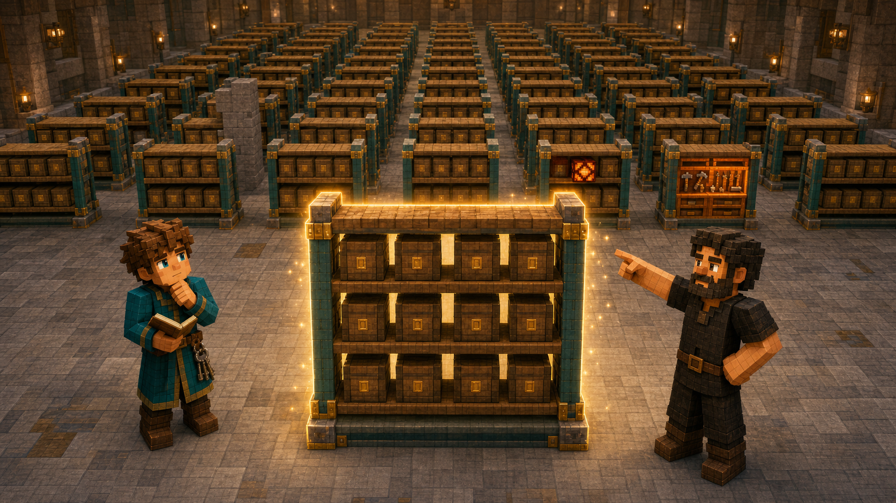
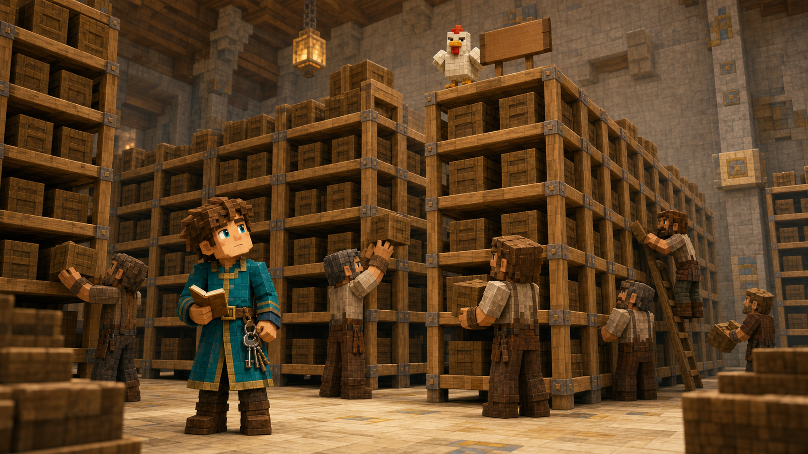

# 第三课 为什么整齐的东西不用一个个数？

## 第一部分 四十八座一模一样的货架

北方远征队的装备刚刚准备完毕，皇家第一仓库就彻底装不下了。

这并不是因为王国突然变富了。准确地说，是因为王国终于承认，过去十年里保存的那些“暂时不知道有什么用，但以后可能会用到”的东西，确实占用了空间。

第一仓库的箱子已经堆到了屋梁下面。铁锭和铜锭不得不共用货架，矿车被吊在天花板上，一批无人认领的木锄则被塞进了盔甲架后面。仓库管理员把这种安排称为“充分利用立体空间”，托马斯却觉得，那几辆悬在头顶的矿车只是在等待一个足够有戏剧性的时机掉下来。

国王于是批准修建皇家新仓库。

新仓库位于旧仓库后方，是一座宽阔的石砖大厅。地面铺着磨制安山岩，屋顶安装了玻璃天窗，墙上的红石灯每隔几格便有一盏。几十座深色橡木货架排列得整整齐齐，从入口一直延伸到大厅尽头。

建筑完工那天，皇家建筑师带着托马斯前来验收。

大门打开以后，托马斯站在门口，一时没有说话。

六排货架。

每排八座。

每座货架五层。

每层可以并排放置四只标准箱。

四十八座货架大小相同、方向相同、颜色相同，连每一层木板上的结疤都像是按照某种规矩长出来的。单独看一座货架很清楚，可几十座一模一样的货架摆在一起后，反而令人产生一种奇怪的眩晕感，仿佛自己走进了一座专门用来测试记忆力的木头迷宫。

一只鸡已经站在第六排货架的最高处。

托马斯抬头看着它。

“它为什么在那儿？”

建筑师也抬头看了一眼。“施工队昨天搭过脚手架。”

“脚手架已经拆掉了。”

“所以它现在下不来了。”

鸡低头望着他们，神情十分平静。对于鸡来说，无法下来似乎并不算事故，只是一种临时的高处工作安排。

建筑师把图纸铺在一只空箱子上。

“国王今天下午要接收第一批物资。在箱子运进来以前，他需要知道这座大厅一共能放多少只标准箱。”

托马斯点了点头。

“六排，每排八座货架。每座五层，每层四只。”

他说完便拿出账本，走到第一座货架前。

最下面一层有四个箱位。

第二层有四个。

第三层、第四层和第五层也完全相同。

托马斯从左到右、从下到上数完第一座货架，在账本上写下：

**二十个箱位。**

他走到第二座货架前，又从第一层开始数。

仍然是二十个。

第三座货架也是二十个。

第四座还是二十个。

数到第六座时，托马斯停了下来。

“建筑师。”

“怎么了？”

“这些货架真的完全一样吗？”

“都按照同一张图纸建造。”

“会不会有哪一座偷偷多出一层？”

建筑师看了他一会儿。

“货架通常不会在夜里生长。”

“树会。”

“货架已经不是树了。”

这个回答从建筑学角度没有问题，但托马斯仍然逐层检查了第七座。他刚在第一排最后一座货架旁做下标记，一名搬运工推着矿车经过，顺手把标记用的黄色羊毛捡走了。

“那是我的记号。”托马斯喊道。

搬运工停下来，指向墙边一块写着“通道内不得堆放杂物”的木牌。

“哼。”

“我需要知道哪些货架已经数过。”

搬运工又看了看四周一模一样的货架。

“哼。”

托马斯大概听懂了。这一声“哼”的意思可能是：既然所有货架都长得一样，你为什么要把同一件事做四十八遍？

他重新回到第一排，试着只在账本上记录进度。

第一排第一座。

第一排第二座。

第一排第三座。

可是数到第二排中间时，他开始怀疑自己刚才究竟是在第二排第五座，还是第三排第四座。整齐的排列有一个令人烦恼的副作用：它让统计变得容易，也让迷路变得十分体面。

托马斯决定给每一排挂上编号木牌。

第一排。

第二排。

一直到第六排。

每一排内部的货架再从一到八编号。

这样，他终于不会因为转身捡一支炭笔，就突然忘记自己身处仓库的哪一片木头森林。

可新的问题很快出现。

如果每一座货架都是二十个箱位，那么他为什么还要逐座数？

第一座二十个。

第二座也是二十个。

无论走到哪一座，结果都没有变化。

建筑师明明已经把规律写在图纸上，托马斯却像是为了证明自己勤奋，认真把同一个答案重复计算了很多遍。人类有时会把已经完成的工作再做一遍，并把这种行为称为谨慎；如果重复次数足够多，也可能被称为管理流程。

托马斯看向还没数完的几十座货架。

“如果我已经知道一座货架有二十个箱位，又知道一共有四十八座货架，是不是不用再一座一座数？”

建筑师点了点头。

“图纸本来就是这个意思。”

“那你为什么不早说？”

“我以为你正在检查施工质量。”

建筑师说得十分认真。托马斯无法判断这究竟是解释，还是一种建筑师特有的报复。

他回到图纸旁边，写下：

\[
5\times4=20
\]

一座货架五层，每层四个箱位，所以一座货架有二十个箱位。

大厅共有：

\[
6\times8=48
\]

座货架。

如果所有货架都完全符合标准，那么总箱位就是：

\[
48\times20=960
\]

也可以一次写成：

\[
6\times8\times5\times4=960
\]

托马斯看着这个算式。

六排。

每排八座。

每座五层。

每层四格。

他并没有真的走过九百六十个位置，却已经知道它们一共有多少。

原因不是计算变快了。

而是世界本身在重复。

只要数清最小的那一块，再知道它重复了多少次，就不必把相同的工作重新完成几百遍。

托马斯正准备把“九百六十”写进报告，建筑师却把一根手指压在账本上。

“先别交。”

“为什么？”

建筑师指向大厅最右侧。

那里有一根粗大的石柱，从地面一直支撑到屋顶。为了避开石柱，第一排和第二排最右边的两座货架都少了最上面一层。

“这根柱子原本不在图纸上。”托马斯说道。

“施工到一半时，我们重新计算了屋顶重量。”

“然后呢？”

“发现加一根柱子，比国王参观时屋顶掉下来更合适。”

托马斯承认，这是一项值得支持的设计变更。

建筑师又指向第三排最后一座货架。那里安装着一盏红石灯，占用了一个箱位。

“仓库已经有很多灯了。”

“安全大臣要求每个阴暗角落都增加照明。光照不足会生成怪物。”

托马斯看了看那盏灯，又想起第一仓库里的苦力怕。

少放一只箱子，确实比少一面墙便宜。并不是所有空位都应该被填满，有些空位实际上是在购买安全。

第四排最右边的货架底层则被改成了工具柜，用来存放锤子、木板和备用零件。建筑师解释说，铁匠拒绝在每次维修货架时都穿过半个王城取工具。

“所以还有多少例外？”托马斯问。

建筑师翻了一页图纸。

就在这时，大厅另一侧传来一声轻微的断裂声。

第一排第三座货架的第二层缓缓向下倾斜。站在旁边的铁傀儡收回手臂，静静地望向远方。

托马斯走过去。

“它为什么推货架？”

建筑师检查了一下裂开的木板。“可能是在测试牢固程度。”

“结果呢？”

“现在我们知道这一层不够牢固。”

铁傀儡保持着一种完成了公共安全检查的庄严神情。它从不解释自己的工作方法，和某些经验丰富的管理人员十分相似。

托马斯在报告上补充：

**第一排第三座，暂时损失一层箱位。**

规律仍然存在。

绝大多数货架依然完全相同。

可现实偏偏在几个角落里留下了石柱、红石灯、工具柜和一块被铁傀儡推坏的木板。

托马斯终于意识到，使用规律并不等于假装例外不存在。

真正可靠的办法应该是：

先利用规律算出完整的标准结构。

再单独处理那些不遵守标准的地方。

## 第二部分 先数一小块，再得到整个大厅

Notch来到新仓库时，托马斯正在图纸上圈出几处例外。

他今天没有带橡木原木，而是拿着一只空箱子。那只箱子看起来非常普通，但在皇家仓库里，“普通空箱子”通常意味着它很快会被装进一些没人记得是谁放进去的东西。

Notch走到一座标准货架前。

“你最开始准备怎样数？”

“把每个箱位全部数一遍。”

“为什么后来不数了？”

“因为每座标准货架都一样。数清一座，就知道其他所有标准货架。”

Notch指向一层货架。

“还可以再小吗？”

托马斯看向那一层的四个箱位。

“一层有四个。”

“一座货架呢？”

“五层，每层四个，所以是二十。”

“整排？”

“八座，每座二十，共一百六十。”

“整个大厅？”

“六排，所以标准容量是九百六十。”

Notch点点头。

托马斯已经不再只是把四个数字相乘，而是看见了数字背后的层级。

箱位组成一层。

层组成一座货架。

货架组成一排。

六排再组成整个仓库。

每一级都在重复上一级的结构。

如果某一级完全相同，就不必再次拆开逐个统计。

托马斯把这一过程写在图纸旁：

\[
4
\rightarrow
5\times4
\rightarrow
8\times5\times4
\rightarrow
6\times8\times5\times4
\]

Notch问道：“你真正找到的是什么？”

“重复的单位。”

“最小的单位一定是一个箱位吗？”

托马斯想了想。

“可以是一个箱位，也可以是一层，或者一整座货架。只要知道这个单位有多少，以及它重复了多少次，就能继续向上计算。”



这正是规则排列最有价值的地方。

整齐并不只是看起来舒服。

整齐意味着，同一种结构在重复。

而重复意味着，人不必反复完成同样的统计。

托马斯开始修正例外。

标准容量是：

\[
960
\]

石柱影响了两座货架，每座少一层。每层四个箱位，因此减少：

\[
2\times4=8
\]

红石灯占用一个箱位，减少一。

工具柜占据一整层，减少四。

铁傀儡推坏的木板使一层暂时不能使用，再减少四。

所有不能使用的箱位一共是：

\[
8+1+4+4=17
\]

所以当前真正可用的箱位为：

\[
960-17=943
\]

托马斯在报告上写下两个数字：

**标准容量：九百六十。**

**当前可用容量：九百四十三。**

这两个数字都正确，却回答不同的问题。

九百六十描述的是图纸上的完整标准结构。

九百四十三描述的是今天真正能够使用的仓库。

国王来到大厅验收时，先看了报告，又看了看那根石柱。

“如果石柱是例外，为什么不把整座仓库重新数一遍？”

“因为四十八座货架中，绝大多数仍然遵守同一个标准。”托马斯说道，“把所有箱位重新逐个统计，不但慢，而且更容易漏数或重复。先计算规则部分，再修正少数例外，会更清楚。”

“那如果例外很多呢？”

“如果例外多到每座货架都不一样，就不能再把它们当成同一种重复结构。规律必须真的存在，不能为了方便强行假装存在。”

国王点点头。

“也就是说，规律不是命令。”

“是描述。”

这一次，Notch没有继续提问。

他只是站在货架之间，看了托马斯一眼。

托马斯已经明白，规律并不会强迫现实服从它。规律只是帮助人描述那些真正重复的部分。

如果世界整齐，就利用整齐。

如果有少数例外，就单独修正。

如果处处都是例外，那便应该承认：这里根本不存在可以直接重复使用的标准单位。

下午，第一批箱子被运进大厅。

托马斯给每个位置规定了地址。

第二排、第三座、第四层、第一格。

第五排、第八座、第二层、第三格。

只要四个数字确定，搬运工就能找到唯一位置。以前的仓库地址经常写成“靠里面那一排，在那只棕色羊附近”，可羊会走动，位置最好不要依赖拥有腿的参照物。

那名经常发出“哼”的村民拿着一张入库单，准确找到了第四排第二座货架。他把箱子放在指定位置，回头看了托马斯一眼。

“哼。”

这一声比平时短了一点。

托马斯认为，这大概代表村民已经承认编号制度比寻找棕色羊可靠。大概。

高处那只鸡依旧没有下来。

建筑师最后只好在第六排第五座货架旁挂上一块牌子：

**上方有鸡，放置箱子时注意。**



托马斯问：“它算例外吗？”

建筑师认真看了一会儿。

“它没有占用箱位。”

“那就不减？”

“不减。”

鸡在货架顶端踱了两步，显得对自己没有被计入仓库容量这件事略感不满。

后来，数学家并没有专门把这件事命名为“皇家仓库货架原理”。这多少有些遗憾。

但其中的思想十分普遍：

**面对整齐重复的对象，先找到一个重复单位。**

**算清这个单位有多少，再乘以它重复的次数。**

**如果存在少量例外，就从标准结果中单独修正。**

托马斯在笔记本上写下：

\[
\text{总量}
=
\text{每个单位的数量}
\times
\text{单位个数}
\]

如果还有例外：

\[
\text{实际总量}
=
\text{标准总量}
-
\text{不能使用的部分}
+
\text{额外增加的部分}
\]

他没有把这两行当作必须背下来的公式。

因为真正重要的不是乘号和减号，而是先看见世界中哪些部分在重复，哪些部分没有重复。

## 第三部分 程序员时间：机器不介意把同一件事做四十八遍

红石工程师听说新仓库共有九百四十三个可用箱位后，立刻提出了一个宏伟方案。

“我们可以在每个箱位安装一个红石比较器，再连接一盏指示灯。绿色代表空，红色代表已占用，闪烁代表有人把物品放错位置。”

建筑师问：“一共需要多少比较器？”

“九百六十个。”

“仓库里有多少？”

“七十三个。”

“剩下的呢？”

“制造。”

“需要多少下界石英？”

红石工程师打开材料表，计算了一会儿，默默把图纸卷了起来。

有时候，最成功的工程设计，不是把机器造出来，而是在算完材料以后及时放弃。能在施工前发现资源不够，通常比施工到一半发现屋顶不够更受欢迎。

托马斯把仓库结构和例外告诉工程师。他们没有逐个录入九百六十个箱位，只把重复关系和例外写进程序：

```cpp
#include <iostream>
using namespace std;

int main() {
    int rows = 6;
    int shelvesPerRow = 8;
    int levels = 5;
    int boxesPerLevel = 4;

    int standard =
        rows * shelvesPerRow
        * levels * boxesPerLevel;

    int blockedByPillar = 2 * boxesPerLevel;
    int redstoneLamp = 1;
    int toolCabinet = boxesPerLevel;
    int brokenLevel = boxesPerLevel;

    int unavailable =
        blockedByPillar
        + redstoneLamp
        + toolCabinet
        + brokenLevel;

    cout << standard << '\n';
    cout << standard - unavailable << '\n';
}
```

程序输出：

```text
960
943
```

第一个数字是标准容量。

第二个数字是修正例外后的实际容量。

程序没有走进仓库，也没有真的检查每一块木板。它只是按照托马斯发现的结构进行计算：

六排。

每排八座。

每座五层。

每层四格。

然后减去几处已知例外。

“这一次，机器没有把所有箱位逐个数完。”托马斯说道。

“因为没有必要。”工程师回答，“既然结构重复，程序也可以直接利用重复关系。”

“如果某一座货架后来增加了一层呢？”

“把增加的四个箱位加回来。”

“如果损坏的那一层修好了呢？”

“再加四个。”

“如果那只鸡在货架顶上下了一只蛋呢？”

工程师想了一会儿。

“蛋不占用标准箱位。”

高处的鸡忽然叫了一声，仿佛再次对模型表达了正式异议。

Notch站在实验室门口，看着屏幕上的九百四十三。

“程序为什么能这么短？”

托马斯回答：“因为现实世界里有大量相同结构。我们把重复关系说清楚以后，程序不必记住每一个位置。”

“如果所有货架都不一样呢？”

“程序就必须保存更多信息。短不是因为机器聪明，而是因为问题本身有规律。”

Notch点了点头。

规则越清楚，需要描述的东西就越少。

这不仅是计数的力量，也是人类能够理解庞大世界的原因。没有人会逐滴统计一桶水，也不会逐粒计算一组沙子。只要找到重复单位和它们之间稳定的关系，巨大的数量就能被压缩成几个数字。

当天傍晚，建筑师又带来了一张新图纸。

这一次不是仓库，而是王国南边的新农田。

整片土地被横竖交错的石砖小路分成四行六列，共二十四个小方格。

“国王准备把其中一部分租给农夫。”建筑师说道，“每块出租土地必须是长方形，可以只有一个方格，也可以由很多相邻方格组成。”

托马斯看了看图纸。

四行乘六列。

二十四个最小方格。

可建筑师用手指圈出一片两行三列的区域。

“这一整片也是一块长方形。”

他又圈出一行四列、三行两列，以及整片农田。

托马斯忽然发现，这一次要数的已经不是固定的小方格。

同样二十四个格子，可以组成很多不同大小、不同位置的长方形。

整齐仍然存在。

可单纯使用“行数乘列数”，只能数出最小格子的数量。

不能数出所有可能的长方形。

托马斯盯着图纸上纵横交错的边界线。

新仓库里，每个位置大小固定，所以只要找到重复单位就够了。

但农田里的长方形大小可以改变。

这一次，真正决定一个长方形的，恐怕不是它里面有多少格。

而是围住它的那些边界。
