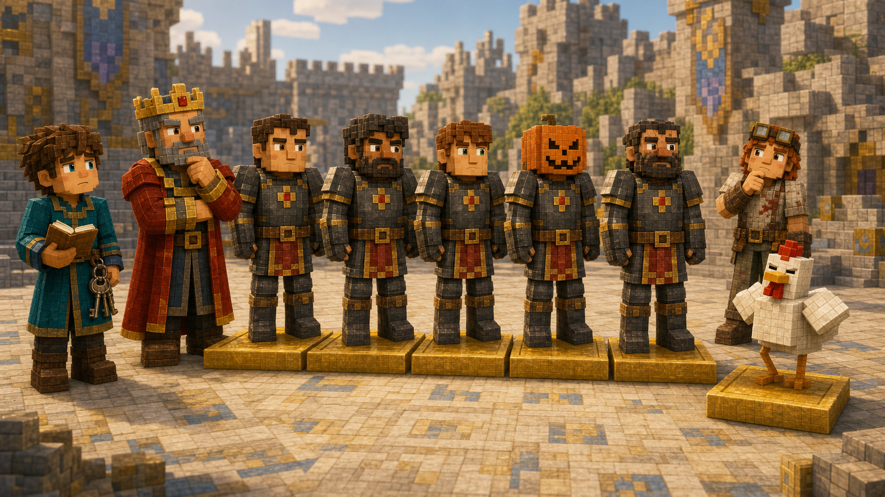
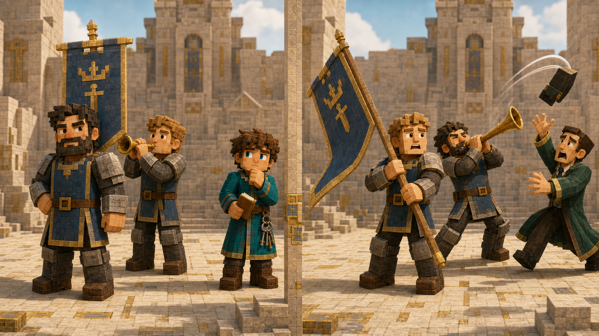

# 第五课 为什么站的位置会改变答案？

## 第一部分 六名骑士与七百二十场仪式

王国建城纪念日到来之前，城堡广场被彻底翻修了一遍。

建筑师在地面铺上新的石砖，财政大臣在每一块石砖旁边计算预算，红石工程师则在城门上方安装了一套自动烟花装置。他声称，只要仪仗队走到指定位置，压力板就会自动触发烟花，为使者展示王国最先进的红石技术。

第一次测试时，装置确实自动触发了。

唯一的问题是，红石信号接反了。烟花没有飞向天空，而是从城门后方横着射了出去，惊动了马厩里的六匹马、一只鹦鹉和三名正在吃午饭的守卫。

红石工程师检查完线路，给出了一个令人安心的结论：“烟花部分没有问题。”

建筑师问：“那什么有问题？”

“方向。”

在皇家工程中，方向通常不被认为是“烟花部分”的组成部分。它更像现实世界强行附加的一项要求。

托马斯来到广场时，六个站位已经用金色方块标记出来。六名骑士站在一旁等待排练，分别是亚瑟、雷恩、凯恩、诺亚、莱恩和维克。

其中一人头上仍戴着那只附有绑定诅咒的雕刻南瓜。

托马斯已经不再询问这件事的进展。人类面对一个短期内无法解决的问题时，通常会逐渐把它当成当事人的个人风格。

国王站在城堡台阶上，向众人宣布仪式规则。

第一名骑士站在最前方，手举王国旗帜。

第二名骑士负责吹响号角。

第三名到第六名依次站在后方，组成迎宾仪仗队。虽然他们没有特殊道具，但站位仍然不同：第三位紧跟号手，最后一位负责在队伍转弯时确保没有人走进喷泉。

“六名骑士都要参加。”国王说道，“我想知道，他们一共有多少种不同的站法。”

托马斯看向六个位置，又看向六名骑士。

这一次，他没有立刻相加。

六个人必须全部进入队伍，每个人占据一个位置。一旦两个人交换位置，旗手、号手或者队列顺序便会发生改变。

顺序显然重要。

托马斯决定先把所有站法列出来。

第一种：

亚瑟、雷恩、凯恩、诺亚、莱恩、维克。

第二种，他只交换最后两人：

亚瑟、雷恩、凯恩、诺亚、维克、莱恩。

第三种，再调整倒数第三个位置。

写到第十行时，托马斯发现自己已经开始怀疑某个顺序是否刚刚出现过。六个名字反复交换位置后，账本看起来像一群骑士在纸上举行了一场没有指挥的阅兵。

他试着给每个名字使用不同颜色。

亚瑟是红色，雷恩是蓝色，凯恩是绿色，诺亚是黄色，莱恩是紫色，维克是黑色。

结果一阵风吹过，几张名单翻到一起，红、蓝、绿、黄的线条互相覆盖。那只经常出现在托马斯附近的鸡正好踩上墨水，又从名单中间走过，在好几种排列上留下了一串黑色脚印。

其中一个脚印正好盖住了维克的名字。

托马斯看着那行排列。

“现在这里有五名骑士和一只鸡。”

红石工程师走过来检查了一眼。

“鸡没有被登记为骑士。”

鸡站在第六个金色方块上，挺起胸口，显然认为登记制度存在严重偏见。

国王看了看鸡，又看了看那名戴南瓜的骑士，似乎认真考虑过两者在仪仗队中的视觉效果，最后还是让守卫把鸡抱到广场外面。



托马斯重新整理名单。他很快意识到，逐行写下所有排列并不是最好的办法。数量还不知道有多少，检查却已经变得十分困难。

他决定从第一个位置开始。

第一个位置是旗手。

六名骑士中的任何一人都可以站在这里，因此有六种选择。

假设亚瑟站在第一位，剩下的五人要安排到后面五个位置。第二位可以从剩下五人中选择。

如果雷恩站在第二位，第三位还剩四种选择。

随后依次是三种、两种和一种。

托马斯在地面摆出六块写有名字的木牌，按照顺序一块块放入金色站位。他放到第三块时，忽然停了下来。

最开始，第一个位置有六个人可选。

选走一人后，第二个位置只剩五人。

再选一人，第三个位置只剩四人。

因为同一名骑士不能同时站在两个位置，所以每安排一个位置，可选择的人便减少一名。

完整的选择过程是：

\[
6\times5\times4\times3\times2\times1
\]

托马斯计算了一遍，得到：

\[
720
\]

他盯着这个数字，有些不敢相信。

广场上明明只有六名骑士，站法却有七百二十种。

铁匠拿起两块名字牌，随手交换了一下。

“这样就多一种？”

“是。因为两人的位置变了。”

铁匠又交换一次。

“又多一种？”

“只要这个顺序以前没有出现过，就是新的。”

铁匠看了看广场上的六名骑士。

“看来人不需要增加，只要不断换位置，就能制造大量工作。”

财政大臣听见这句话，立刻记在了账本上。凡是能够在不增加人员的情况下扩大项目规模的方法，都很容易引起他的兴趣。

托马斯为了确认自己的推导，先把问题缩小到三名骑士。

亚瑟、雷恩和凯恩站在三个位置上。

可能的顺序是：

亚瑟、雷恩、凯恩。

亚瑟、凯恩、雷恩。

雷恩、亚瑟、凯恩。

雷恩、凯恩、亚瑟。

凯恩、亚瑟、雷恩。

凯恩、雷恩、亚瑟。

一共六种，正好等于：

\[
3\times2\times1=6
\]

四个人全部排列时，则有：

\[
4\times3\times2\times1=24
\]

六个人全部排列，便是七百二十。

这不是因为六这个数字特别神奇，而是因为每确定一个位置，剩余人选都会减少一个。

托马斯没有等Notch出现。

他自己走到广场边，重新看了一遍六个金色方块。

真正决定一种仪仗队排列的，是每一名骑士分别站在哪个位置。

如果两名骑士交换后，仪仗队被认为发生了变化，那么这两个排列就是不同结果。

这一次，他已经知道该问什么：

**交换两个人的位置，答案会不会改变？**

如果会，顺序就是问题的一部分。

Notch直到排练接近结束才来到广场。他站在石砖路旁，看见托马斯账本上的七百二十。

“今天没有画满七百二十行？”他问。

“没有必要。”

“为什么？”

“我只要按位置依次选择。第一个位置有六种，第二个有五种，然后是四、三、二、一。”

Notch看向正在重新排队的骑士。

“如果他们站成一圈呢？”

托马斯愣了一下。

Notch却没有继续问下去。

“今天先数直线。”

他说完便走向城门，给托马斯留下了一个暂时不必解决的新麻烦。Notch很擅长这种事情：一个问题刚刚变清楚，他就会从旁边放下另一个问题，然后若无其事地离开。

## 第二部分 不是所有人都必须上场

数学家把：

\[
6\times5\times4\times3\times2\times1
\]

这种从六一直乘到一的写法，记作：

\[
6!
\]

读作“六的阶乘”。

感叹号放在数字后面，看起来像数学家突然提高了音量：

“六！”

不过，当六名骑士只靠换位置就能制造七百二十种队形时，这种惊讶并不算过分。

一般来说，\(n\) 个不同对象全部排成一列，第一个位置有 \(n\) 种选择，第二个位置剩 \(n-1\) 种，接着不断减少，直到最后只剩一个对象。

因此，全部排列数量是：

\[
n!
=
n\times(n-1)\times(n-2)\times\cdots\times2\times1
\]

这种把所有对象都安排进不同位置的情况，叫作**全排列**。

托马斯把七百二十种写进报告后，原以为这一天的计数工作已经结束。国王却翻开仪式安排表的下一页。

“正式仪式不需要六人全部担任重要职务。”他说，“王国共有十二名骑士，我只需要安排三项任务。”

第一项是旗手，站在队伍最前方。

第二项是号手，负责吹响欢迎号角。

第三项是护卫长，负责站在使者身侧。

“从十二名骑士中安排这三个职位，一共有多少种不同方案？”国王问。

托马斯看向十二名骑士的名单。

这一次，不是所有人都要上场。

但三个职位不同。

亚瑟担任旗手、雷恩担任号手、凯恩担任护卫长，与凯恩担任旗手、雷恩担任号手、亚瑟担任护卫长，显然不是同一种安排。

人选相同，职位交换，结果仍然发生了变化。

顺序依然重要。

旗手可以从十二名骑士中选择，有十二种。

旗手确定以后，号手不能再使用同一个人，只剩十一种。

护卫长再从剩下十人中选择。

因此，方案数是：

\[
12\times11\times10=1320
\]

国王问：“为什么后面不继续乘九、八、七？”

“因为只需要安排三个职位。”托马斯回答，“当三个位置都确定以后，方案已经完整。剩余九人不担任这三项任务，他们之间怎样站立，不影响当前结果。”

这与全排列的区别十分清楚。

全排列要求把所有 \(n\) 个对象全部放入 \(n\) 个位置，所以一直乘到一。

现在只从 \(n\) 个对象中选出 \(m\) 个，并依次放入 \(m\) 个不同位置，只需要完成前 \(m\) 步。

第一步有 \(n\) 种。

第二步有 \(n-1\) 种。

一直到第 \(m\) 步，剩下：

\[
n-m+1
\]

种。

数学家把这种数量记作：

\[
P(n,m)
\]

有时也写作：

\[
A_n^m
\]

它表示从 \(n\) 个不同对象中选出 \(m\) 个，并按照有区别的位置排列。

公式是：

\[
P(n,m)
=
n(n-1)(n-2)\cdots(n-m+1)
\]

因为：

\[
n!
=
n(n-1)\cdots(n-m+1)(n-m)!
\]

所以也可以写成：

\[
P(n,m)
=
\frac{n!}{(n-m)!}
\]

托马斯没有急着背第二种写法。

对他来说，最重要的仍然是前面的选择过程：

十二人中选旗手。

剩十一人中选号手。

剩十人中选护卫长。

公式只是把这三步压缩起来。

铁匠拿出几个任务测试托马斯。

“六名骑士全部站成一列？”

“顺序重要，所有人都参加，是：

\[
6!
\]
”

“十二名骑士中安排旗手、号手和护卫长？”

“只安排三个有区别的位置，是：

\[
P(12,3)
\]
”

“从十名弓箭手中选三人，分别站在左塔、中塔和右塔？”

“左、中、右是不同位置，交换以后结果改变，所以是：

\[
P(10,3)
\]
”

“从十匹马中挑三匹拉同一辆没有固定位置的货车？”

托马斯停了一下。

“如果只关心挑了哪三匹，不区分它们站在哪里，那么交换位置可能不改变结果。”

铁匠问：“那还用排列吗？”

“不能直接用。”

托马斯没有继续计算，因为那已经是另一个问题。

但他已经看到排列方法的边界：

不是只要出现“选择几个”就使用排列。

只有当被选对象进入不同位置、承担不同职责，或者出现的先后会改变结果时，顺序才需要被保留。

他在账本上写下了这一章最重要的检查方法：

**交换两个已经安排好的对象。**

**如果结果改变，顺序重要。**

**如果结果没有改变，就不能把交换后的写法当成新方案。**

建筑师读完这几行，问道：“如果六名骑士站在同一排，只是最左边和最右边位置不同，当然算新排列。可要是他们围成一个圆圈，所有人一起转动一格呢？”

托马斯看了他一眼。

“Notch刚刚也问了这个问题。”

“答案呢？”

“他走了。”

建筑师点点头。“很像他。”

圆形排列比直线排列多了一层“哪些位置算相同”的问题。托马斯把它记在笔记本边角，但没有让它挤进今天的任务。一个问题能够延伸得更远，并不表示必须在第一次见面时把它追到世界尽头。

尤其是在Minecraft里，追得太远通常意味着天黑以后找不到回家的路。

仪仗队终于开始正式排练。

第一轮，亚瑟担任旗手，雷恩负责号角。

第二轮，两人交换位置。亚瑟吹号角时声音非常响，却只吹出一个持续很长的音；雷恩举旗时则把旗杆倾斜得太低，差点扫掉财政大臣的帽子。

“现在你还觉得交换以后是同一个方案吗？”铁匠问。

托马斯看着正在追帽子的财政大臣。

“不觉得。”

位置有时不仅改变数学结果，也会改变现场损失。



## 第三部分 程序员时间：机器不能让同一个骑士站在三个位置

红石工程师为纪念仪式制作了一台自动排位器。

机器面前有三个插槽，分别标着：

旗手。

号手。

护卫长。

十二名骑士各有一块名字牌。只要将三块牌插入不同槽位，机器就会打印一份职务安排。

第一次测试，工程师把亚瑟的名字牌插入旗手位置，又拿起另一块写着亚瑟的牌，插入号手位置。

托马斯看了一眼。

“为什么有两块亚瑟？”

“我复制了备用牌。”

“同一个人不能同时担任旗手和号手。”

工程师检查了机器。“机器可以接受。”

“骑士不可以。”

这再次说明，机器能够接受某种输入，并不代表现实世界愿意配合。红石装置不会因为亚瑟只有一个身体，就主动拒绝第二块名字牌。它只知道槽位里确实插进了一块木牌。

工程师收走所有重复名字牌，规定每安排一个职位，这名骑士就从剩余候选人中移除。

随后，他写下一个计算排列数的程序：

```cpp
#include <iostream>
using namespace std;

long long arrange(int n, int m) {
    long long result = 1;

    for (int i = 0; i < m; i++) {
        result *= n - i;
    }

    return result;
}

int main() {
    cout << arrange(6, 6) << '\n';
    cout << arrange(12, 3) << '\n';
}
```

程序输出：

```text
720
1320
```

第一行是六名骑士全部排列的数量。

第二行是十二名骑士安排三个不同职位的数量。

循环第一次乘 \(n\)，第二次乘 \(n-1\)，之后每安排一个位置，可选对象便减少一个。循环执行多少次，取决于一共需要填多少个位置。

托马斯说道：“全排列其实也是排列的一种特殊情况。”

工程师点点头。

“当 \(m=n\) 时：

\[
P(n,n)=n!
\]
”

“程序知道为什么不能重复使用同一个骑士吗？”

“不知道。”工程师回答，“它只按照规则，每一步把可选人数减一。”

“如果任务允许同一个人重复出现呢？”

工程师看了看三个职务牌。

“那现实问题会变得很奇怪。”

托马斯同意。一个人同时举旗、吹号并担任护卫长，理论上也许能写进名单，实际仪式大概只会展示王国在人力不足方面的创造力。

Notch站在排位机旁边，拿起两张职务安排。

第一张写着：

亚瑟：旗手。

雷恩：号手。

凯恩：护卫长。

第二张写着：

凯恩：旗手。

雷恩：号手。

亚瑟：护卫长。

“选中的三个人相同。”Notch说道，“为什么是两个方案？”

“因为他们承担的职位不同。”托马斯回答，“职位交换以后，结果改变。”

Notch又拿起一张没有职位的名单，上面只写着亚瑟、雷恩、凯恩三个名字。

“如果国王只问，派哪三名骑士去巡逻呢？”

托马斯看着那张名单。

如果只选择成员，不安排旗手、号手和护卫长，那么亚瑟、雷恩、凯恩与凯恩、亚瑟、雷恩，似乎只是同样三个人的不同书写顺序。

交换以后，巡逻队成员并没有改变。

排列会把同一支队伍反复统计很多次。

当天下午，国王果然送来了下一项任务。

北方道路需要一支五人巡逻队。皇家骑士团共有十二人，国王只需要决定哪五人出发，不安排职位，也不规定站位。

托马斯几乎习惯性地写下：

\[
12\times11\times10\times9\times8
\]

但他很快停住了。

这个算式会把同样五个人的每一种排列都当成不同方案。

可国王只关心谁去巡逻。

同一批人无论怎样交换位置，仍然是同一支队伍。

托马斯拿起橡皮，轻轻擦掉了刚写下的结果。

这一回，问题不再是怎样保留顺序。

而是：

**怎样把那些没有意义的顺序全部去掉。**
