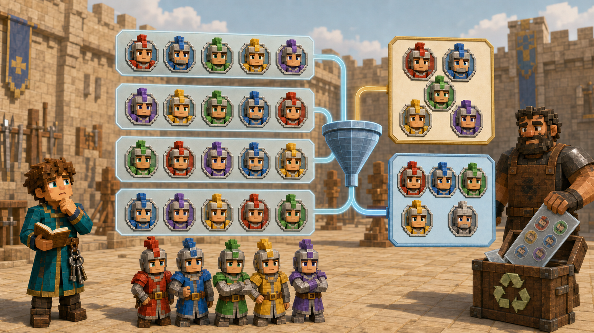
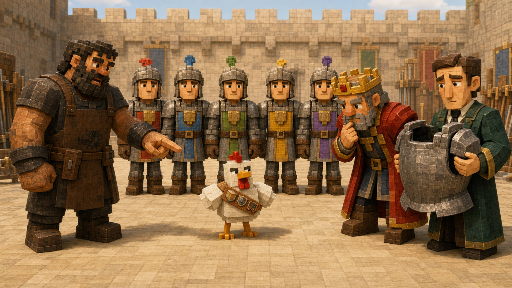

# 第六课 为什么换位置还是同一队？

## 第一部分 九万五千零四十支巡逻队

建城纪念仪式结束后的第二天，北方道路传来了坏消息。

远征队虽然已经赶走了雪原附近的掠夺者，但那些掠夺者并没有真正离开。它们只是退回森林边缘，在一座废弃瞭望塔里重新竖起旗帜，还派出几支小队骚扰来往矿车。最麻烦的是，它们似乎终于学会了不要站在铁傀儡面前挑衅。对于掠夺者来说，这已经算得上明显的战术进步。

国王决定从皇家骑士团中挑选五人，组成一支长期巡逻队。

十二名骑士一早便来到训练场。有人检查弓弦，有人给马喂苹果，还有人忙着解释为什么自己的盾牌上出现了一个苦力怕形状的洞。那名戴着绑定诅咒南瓜的骑士也来了。他已经接受了目前的生活，只是在南瓜侧面钻了两个更大的孔，以便看见左右两边。

托马斯带着账本走到训练场时，国王已经坐在看台上。

“皇家骑士团共有十二人。”国王说道，“我要从中选择五人，组成北方巡逻队。一共有多少种不同的队伍？”

托马斯几乎立刻想起了昨天的排列。

第一个位置可以从十二人中选择。

第二个位置剩十一人。

接下来是十、九和八。

于是，他写下：

\[
12\times11\times10\times9\times8
\]

计算结果是：

\[
95040
\]

“九万五千零四十种。”托马斯说道。

财政大臣原本正在旁边计算巡逻队每天需要多少面包。听到这个数字，他手里的羽毛笔停在了半空。

“九万五千零四十支巡逻队？”

“是九万五千零四十种选择方案。”托马斯纠正道。

财政大臣没有因此放松。

“每一种方案都要单独发放任务单吗？”

“理论上……”

“每张任务单需要一张纸，纸需要甘蔗，甘蔗农场需要水渠，水渠需要施工预算。”

他说到这里，已经开始计算为了打印名单是否需要扩建南方农田。数学有时只是多写了一个零，财政部门却能立刻为它修建一条水渠。

皇家铁匠没有看账本。他从十二名骑士中叫出五人：

亚瑟、雷恩、凯恩、诺亚和莱恩。

五名骑士按照这个顺序站成一排。

“这是一支巡逻队。”铁匠说道。

他让亚瑟站到最后，又让诺亚走到最前面，其余三人也交换位置。

“现在呢？”

托马斯看着五个人。

“还是同一支巡逻队。”

“为什么？”

“因为成员没有变化。仍然是亚瑟、雷恩、凯恩、诺亚和莱恩。”

铁匠又让他们重新排了一次。这回凯恩站在最前面，雷恩和莱恩因为听错名字，同时走向第二个位置，差点撞在一起。

“现在是不是第三支队伍？”铁匠问。

“不是。还是那五个人。”

铁匠指向托马斯的算式。

“可你的算法把这些站法都当成了不同结果。”

托马斯低头看着九万五千零四十。

在建城仪式中，旗手、号手和护卫长承担不同职责，交换位置会改变安排，所以每一种顺序都必须保留。

今天却不一样。

国王只关心哪五名骑士出发，并没有规定谁站在第一位，也没有为五个人分配不同职位。只要成员相同，无论怎样排列，都是同一支巡逻队。

托马斯确实选出了五个人，却又把他们在名单上的不同书写顺序当成了不同队伍。

一匹拴在旁边的马向前走了几步，把五名骑士挤得重新换了位置。

铁匠拍了拍马的脖子。

“它刚才又替你的账本制造了一种新方案。”

马低头吃草，显然没有意识到自己刚完成了一次排列操作。动物对数学贡献的共同特点，是贡献发生以后，它们通常只关心附近有没有食物。

托马斯翻开账本，检查前几种选择。

第一种写着：

亚瑟、雷恩、凯恩、诺亚、莱恩。

另一种则是：

莱恩、诺亚、凯恩、雷恩、亚瑟。

还有一种：

凯恩、亚瑟、莱恩、雷恩、诺亚。

这些排列看起来不同，实际成员却完全一样。

如果五个人可以任意换位置，那么同一支队伍究竟被数了多少次？

托马斯决定先把问题缩小。

他从队伍中叫出亚瑟、雷恩和凯恩，让三人站在训练场中央。

三个人排成一列时，第一位有三种选择。第一位确定后，第二位还有两种，最后一位只剩一人。

因此，一共有：

\[
3\times2\times1=6
\]

种顺序。

三人按照要求依次换位：

亚瑟、雷恩、凯恩。

亚瑟、凯恩、雷恩。

雷恩、亚瑟、凯恩。

雷恩、凯恩、亚瑟。

凯恩、亚瑟、雷恩。

凯恩、雷恩、亚瑟。

从仪仗队的角度看，这是六种不同排列。

可从巡逻队成员的角度看，这六行全部代表同一个选择：亚瑟、雷恩和凯恩。

三人队伍被排列数法重复统计了：

\[
3!=6
\]

次。

如果固定选择五个人，他们内部可以产生：

\[
5!=120
\]

种排列。

也就是说，托马斯计算出的九万五千零四十种有顺序名单中，每一支真正的五人巡逻队，都恰好出现了一百二十次。

不是有些队伍出现一百次，有些队伍出现一百四十次。

任何五名不同骑士，都有完全相同的一百二十种站法。

所以，只要把无意义的顺序全部去掉，真实的队伍数量就是：

\[
\frac{95040}{120}=792
\]

“七百九十二种。”托马斯重新汇报道。

财政大臣松了一口气，随后又立即开始计算七百九十二张任务单需要多少纸。对财政部门而言，一个数字只要大于一，就仍然值得担忧。

国王看着两个答案。

“九万五千零四十为什么错，七百九十二为什么对？”

“前一个答案把每支队伍的不同排列都算成了新队伍。”托马斯说道，“但今天顺序没有意义。同样五个人交换位置以后，成员没有改变。”

“为什么要除以一百二十？”

“因为每支固定的五人队伍，都恰好被重复计算了五的阶乘次。除法不是为了让数字变小，而是为了删掉那些重复写法。”



就在这时，那只经常出现在托马斯附近的鸡从看台下面钻了出来，站到了五名骑士中间。

托马斯看了看六个身影。

“鸡不算巡逻队成员。”

铁匠说道：“它已经参加过仓库、军械库和铁路试运行，实际出勤次数可能比部分骑士还多。”

鸡抬头挺胸，似乎认为资历应当优先于物种限制。

国王最终仍然没有把它加入骑士名单。原因不是它缺少勇气，而是军务大臣拒绝为一只鸡制作标准尺寸的盔甲。



## 第二部分 组合不是把公式背熟，而是把重复去掉

后来，数学家把“从 \(n\) 个不同对象中选择 \(m\) 个，不考虑顺序”的数量叫作**组合数**。

它通常写成：

\[
\binom{n}{m}
\]

也常写成：

\[
C_n^m
\]

从十二名骑士中选择五人组成巡逻队，就是：

\[
\binom{12}{5}
\]

要理解组合公式，可以先从上一章的排列数开始。

从 \(n\) 个对象中依次挑出 \(m\) 个，并把顺序保留下来，排列数是：

\[
P(n,m)
=
n(n-1)(n-2)\cdots(n-m+1)
\]

但如果只关心选了哪些对象，不关心它们内部的顺序，那么每一组固定的 \(m\) 个对象，都会被按照内部排列重复统计：

\[
m!
\]

次。

因此：

\[
\binom{n}{m}
=
\frac{P(n,m)}{m!}
\]

把排列数写成阶乘形式：

\[
P(n,m)=\frac{n!}{(n-m)!}
\]

便得到：

\[
\binom{n}{m}
=
\frac{n!}{m!(n-m)!}
\]

公式看上去比故事复杂，意思却没有改变：

先按顺序选出 \(m\) 个对象。

再除掉它们内部那些没有意义的排列。

托马斯在公式旁边画了一条很粗的箭头，写道：

**组合数不是一种新的神秘乘法。**

**它只是排列数去掉重复以后留下的结果。**

铁匠拿来几种情况，继续检验托马斯是否真正明白了区别。

“十二名骑士中选五人组成巡逻队。”

“组合。只关心成员，交换位置后还是同一队。”

“十二名骑士中选出旗手、号手、护卫长、侦察兵和后勤官。”

“排列。五个职责不同，同样的人交换职责以后会变成新方案。”

“从十种食物中选五种放进补给箱，箱子内部怎么摆不重要。”

“组合。”

“从十种烟花中选五种，按照点燃先后组成庆典表演。”

托马斯想起红石工程师那套曾经横向发射的烟花装置。

“排列。点燃顺序不同，表演结果可能不同，城门受损的位置也可能不同。”

铁匠点点头。

组合与排列面对的并不是两种完全不同的对象。

它们经常面对同一批人、同一批物品，甚至同一组数字。

区别只在于：

**交换顺序以后，是否仍然算同一个结果？**

如果结果改变，保留顺序，使用排列。

如果结果不变，去掉无意义顺序，使用组合。

这项判断必须发生在公式之前。否则，同一道题只改一句话，答案就可能从七百九十二变成九万五千零四十，而计算过程中的每一个乘法还都显得非常正确。数学最危险的错误，往往不是算错，而是认真回答了另一个问题。

国王翻开名单，又提出了一个问题。

“如果选五名骑士出发，是否也等于选择七名骑士留下？”

托马斯看向十二人的完整名单。

每决定哪五人出发，剩下的七人便自动成为留守队伍。

反过来，只要决定哪七人留下，其他五人也自动成为巡逻队。

一支出发队伍对应唯一一支留守队伍。

一支留守队伍也对应唯一一支出发队伍。

所以：

\[
\binom{12}{5}
=
\binom{12}{7}
\]

托马斯没有重新计算，便知道两个答案相同。

一般来说：

\[
\binom{n}{m}
=
\binom{n}{n-m}
\]

选择 \(m\) 个对象，本质上也同时决定了哪 \(n-m\) 个对象没有被选中。

有时，直接数选中的比较容易。

有时，反过来数没选中的反而更简单。

Notch直到这时才出现在训练场边。他没有参与前面的推导，只看了看托马斯账本上的等式。

“你今天真正去掉的是什么？”他问。

“没有意义的顺序。”

“你怎么知道它没有意义？”

“因为交换两个成员以后，国王认为巡逻队没有改变。”

Notch点点头。

“所以在数之前，先要知道什么叫同一个答案。”

这句话看起来简单，却是组合问题的根。

如果国王只关心五名成员，那么内部顺序不重要。

如果后来为五人分配不同职位，那么顺序和职责又会重新进入答案。

对象本身没有告诉人应该使用排列还是组合。

判断标准来自问题对“相同”的定义。

巡逻队选定后，军务大臣宣布由亚瑟、雷恩、凯恩、诺亚和莱恩出发。

铁匠问道：“为什么最后选中了他们？”

国王回答：“因为他们训练成绩最高。”

托马斯看了一眼自己算出的七百九十二。

计数只能告诉国王一共有多少种选择，却不能替国王决定哪一种最好。七百九十二支可能的队伍中，谁最适合去北方，还要考虑体力、经验、武器和是否能看清道路。

那名戴着南瓜的骑士这次再次落选。

军务大臣在评语中写道：

**战斗勇敢，方向感目前难以验证。**

## 第三部分 程序员时间：只给每支队伍一种名字顺序

红石工程师得知共有七百九十二支可能的巡逻队后，决定制作一台名单生成器。

他先让机器按照排列方式生成名单。

机器很快打印出：

```text
亚瑟 雷恩 凯恩
```

随后又打印：

```text
凯恩 亚瑟 雷恩
```

接着是：

```text
雷恩 凯恩 亚瑟
```

“它把同样三个人打印了很多次。”托马斯说道。

工程师检查了一遍机器。

“因为读取顺序不同。”

“可我们需要的是队伍，不是队列。”

他们决定给每名骑士一个固定编号，并规定名单只能按照编号从小到大书写。

例如，五名骑士的编号依次为：

一号亚瑟。

二号雷恩。

三号凯恩。

四号诺亚。

五号莱恩。

如果从中选择三人，那么“亚瑟、雷恩、凯恩”是合法的标准写法。

“凯恩、亚瑟、雷恩”虽然成员相同，却不再允许单独出现，因为编号没有递增。

程序不需要先生成六种排列，再把其中五种删除。

它从一开始就只为每支队伍保留一种标准写法：

```cpp
#include <iostream>
#include <string>
using namespace std;

int main() {
    string knight[5] = {
        "亚瑟", "雷恩", "凯恩",
        "诺亚", "莱恩"
    };

    int total = 0;

    for (int i = 0; i < 5; i++) {
        for (int j = i + 1; j < 5; j++) {
            for (int k = j + 1; k < 5; k++) {
                cout << knight[i] << ' '
                     << knight[j] << ' '
                     << knight[k] << '\n';
                total++;
            }
        }
    }

    cout << "共 " << total << " 支队伍\n";
}
```

程序输出十支不同的三人队伍，正好等于：

\[
\binom{5}{3}=10
\]

其中会出现：

```text
亚瑟 雷恩 凯恩
```

但不会出现：

```text
凯恩 雷恩 亚瑟
```

因为后者只是同一支队伍的另一种书写顺序。

托马斯看着三个不断增大的编号。

“队伍本身没有先后顺序，但程序为了避免重复，给每支队伍规定了一种唯一写法。”

工程师点点头。

“不是说亚瑟在现实中必须站在雷恩前面，而是名单只能这样记录。”

这与仓库分类时的“不重、不漏”仍然是同一个原则。

每支队伍必须出现一次。

不能因为成员换了书写顺序就出现很多次。

也不能因为编号规则太严格，导致某支合法队伍完全无法写出。

数学通过除以 \(m!\) 去掉重复。

程序则通过编号递增，从源头上不生成重复。

两种方法使用的工具不同，目的却完全一样。

Notch站在打印机旁，拿起两张成员相同、顺序不同的旧名单。

“机器知道为什么它们是同一支队伍吗？”

“不知道。”托马斯说道，“它只执行我们规定的标准顺序。”

“那是谁决定顺序无意义？”

“提出问题的人。”

如果国王明天规定名单第一行是队长、第二行是侦察兵，那么程序便不能再随意排序。因为那时，交换顺序会改变职责，原本应该保留的差别也会被机器错误地删除。

机器不会自己知道什么时候应该去重。

它只会按照人给出的规则，非常高效地判断哪些差别可以忽略。如果规则错了，它也会同样高效地删除正确答案。机器对错误没有偏见，这一点既公平，又令人不安。

当天下午，巡逻队准备出发。后勤官把一只远征背包放到托马斯面前，桌上摆着六件物品：

铁剑、床、水桶、火把、牛奶和面包。

“巡逻任务不同，不要求每次固定带五件，也不要求固定带三件。”后勤官说道，“每件物品都可以选择带，也可以选择不带。”

托马斯看向桌上的六件物品。

前一章中，他从十二个人里选出固定的五个人。

组合数回答的是：

**恰好选择多少个。**

但现在，背包里可以有一件、两件、三件，也可能六件全带，甚至什么都不带。

选择数量不再固定。

每件物品都拥有一个独立决定：

带上。

或者留下。

那只鸡正好从门外经过，看见空背包后，毫不犹豫地钻了进去。

后勤官看着它。

“鸡算一件物品吗？”

托马斯把鸡抱出来，合上背包。

“不算。”

鸡发出不满的叫声。

但托马斯已经顾不上处理它的意见。

因为他隐约感觉到，当每件物品都能独立选择时，所有方案的数量将不再是某一个组合数。

而是很多不同大小的组合，一起组成的一个更大的世界。
