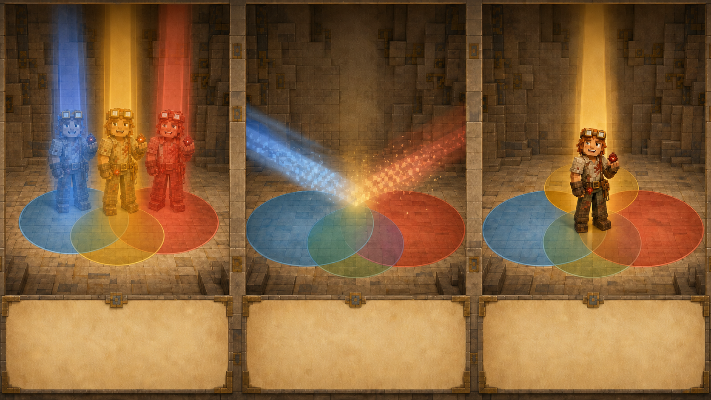

# 第九课 为什么有些人不能被数两次？

## 第一部分 王国突然多出了七十个人

丰收节是王国一年中最热闹的日子。

南方农田收获了小麦、胡萝卜、马铃薯和甜菜根，北方矿山送来了新发现的矿石，建筑师完成了一座巨大的城堡模型，红石工程师则宣布，他将在庆典上展示一台“绝对不会把参观者弹进水池”的自动机器。

建筑师听完这句话，立即要求把机器放到离水池远一点的地方。

庆典广场被分成三个区域。

东边是矿石展览区，里面陈列钻石、绿宝石、紫水晶和各种矿工从地下带回来的奇怪石头。其中有一块看起来与普通圆石完全相同，但发现它的矿工坚持说，它在凌晨三点的月光下会显得“稍微更有历史感”。

西边是建筑比赛区。参赛者可以搭建房屋、城堡、桥梁或者任何能够在规定范围内完成的建筑。国王特意写明，四根泥土柱加一块玻璃不能算“现代主义瞭望塔”。这条规则显然不是凭空出现的。

广场中央是红石展示区。红石工程师准备了自动门、自动农场、自动分类器，以及一台能够在发现故障时自动亮起红灯的故障报警器。测试时，报警器一直亮着，工程师认为这充分证明了它非常可靠。

庆典开始前，财政大臣负责统计参加活动的居民数量，以便准备食物、座位和纪念徽章。

三份报名名单很快送到了他的桌上。

矿石展览区共有一百二十人。

建筑比赛区共有一百五十人。

红石展示区共有一百人。

财政大臣拿起羽毛笔，写下：

\[
120+150+100=370
\]

“共有三百七十名参与者。”他说，“准备三百七十份面包、南瓜派和纪念徽章。”

托马斯站在旁边，看了一眼广场入口。

王国只准备了三百枚入场手环。负责发放手环的守卫却报告说，所有报名者进入以后，手环还剩十五枚。

也就是说，真正进入广场的人只有二百八十五名。

“名单上有三百七十人，门口却只进来了二百八十五人。”托马斯说道。

财政大臣皱起眉头。“守卫少数了八十五人？”

守卫立刻摇头。“每人一只手环。我不会把八十五个人漏过去。”

“会不会有人翻墙？”

建筑师说道：“翻墙进入庆典的人不会让门口少发手环，只会让广场里的人更多。”

红石工程师检查了一遍自动计数门。

“机器部分没有问题。”

托马斯看向他。“你确定？”

“每经过一人，红石灯增加一次。我们还让铁傀儡来回走了二十遍，计数完全准确。”

“铁傀儡也参加庆典？”

“没有。后来减掉了二十。”

托马斯觉得，让铁傀儡来回通过计数门，再人工减掉二十次，多少有些失去了自动化的意义。不过，这至少证明入口计数大概没有出错。

就在众人争论时，一名村民从三个活动区之间走了过来。他左手拿着矿石展览的蓝色徽章，右手拿着建筑比赛的黄色徽章，胸前还挂着红石展示区的红色徽章。

财政大臣拦住他。

“你报名了几个活动？”

村民抬起三根手指。

“矿石、建筑和红石都参加？”

“哼。”

“那你在三张名单里各出现了一次？”

“哼。”

财政大臣低头看向三份名单。

同一个人，进入广场时只需要一只手环，却在报名人数中出现了三次。

另一名村民也走了过来。他报名参加矿石展览和建筑比赛，因此出现在两张名单中。

建筑师本人参加了建筑比赛和红石展示。

红石工程师则报名了矿石展览、建筑比赛和红石展示。他解释说，矿石区需要介绍红石矿，建筑区需要展示红石门，红石区显然更不能没有他。

财政大臣问：“所以你一个人被统计了三次？”

工程师点点头。“三项工作都确实存在。”

“但人只有一个。”

工程师低头看了看自己，像是在确认这项限制是否能够通过技术手段解决。

托马斯终于明白，三百七十不是参加庆典的居民数量。

它是三张名单长度的总和。

只参加一个活动的人，被数了一次。

参加两个活动的人，被数了两次。

三个活动都参加的人，则被数了三次。

人数没有变多。

只是同一批人在名单之间来回出现，成功把一个王国统计得比实际更加繁荣。财政大臣平时非常喜欢增长数字，这一次却不太高兴，因为每多出来一个“人”，后勤部门就要多准备一份食物。

那只经常出现在托马斯附近的鸡也来到报名处。工作人员不知出于什么考虑，在它脖子上挂了一枚红石展示徽章。

托马斯问：“鸡报名了什么？”

红石工程师回答：“它参加自动分类器测试。”

“做什么？”

“被分类。”

鸡昂着头站在展示台上，显然认为自己属于重要嘉宾，而不是测试材料。

托马斯把三张名单铺在桌面上。

第一课中，他把仓库物资分成互不重叠的类别。橡木原木不会同时算作白桦木板，一件材料只进入一个统计项目，所以各类数量可以直接相加。

今天却不同。

一个人完全可以同时属于矿石展览区和建筑比赛区，也可以三个活动都参加。

这些类别不是分开的。

它们发生了重叠。

如果仍然直接相加，同一个人就会被重复计算。

“我们需要把多算的那些人减掉。”托马斯说道。

财政大臣立刻拿起笔。“减多少？”

托马斯看着三张互相交叉的名单，没有马上回答。

两张名单重叠时，似乎只需要减去同时出现的人。

可三张名单一起重叠时，一个人可能出现在两张，也可能出现在三张。减得太少，重复仍然存在；减得太多，一个真实存在的人甚至可能从统计表里彻底消失。

财政大臣在数字问题上可以接受居民缴税，却不能接受居民在账本里变成负数。负数居民既不会缴税，还会让年终报告非常难写。

托马斯决定先从两个活动开始。

## 第二部分 减掉重复以后，为什么还要加回来？

托马斯暂时放下红石展示区，只看矿石展览和建筑比赛两张名单。

矿石展览区有一百二十人。

建筑比赛区有一百五十人。

如果直接相加：

\[
120+150=270
\]

但其中有四十人同时参加两个活动。

这四十人第一次在矿石名单中被数到，第二次又在建筑名单中被数到。每个人实际只应该出现一次，却被统计了两次。

因此，需要把多出来的那一次减掉：

\[
120+150-40=230
\]

矿石展览和建筑比赛一共有二百三十名不同参与者。

建筑师拿来蓝色和黄色羊毛，在广场地面围出两个相互重叠的大圆。

左边蓝色圆代表矿石展览。

右边黄色圆代表建筑比赛。

只参加矿石活动的人站在蓝色圆独有的部分，只参加建筑比赛的人站在黄色部分，同时参加两项活动的人则站在中间重叠区域。

一名村民站在两个圆交界处，左右看了看。

“我该站哪边？”

“你两个活动都参加，就站在重叠区域。”托马斯回答。

村民走进中间。

另一名只报名建筑比赛的村民也跟着走了进去，因为他觉得那里离食物桌更近。

托马斯把他请回黄色区域。

数学图形能表示规则，却不能阻止村民为了少走几步而违反规则。任何模型一旦放到现实中，首先遇到的通常不是复杂数学，而是有人嫌正确位置太远。

两个圆的情况很清楚：

先把两边全部加起来。

再减掉中间被数了两次的部分。

数学家用符号把矿石参与者记作集合 \(A\)，建筑参与者记作集合 \(B\)。

两项活动至少参加一项的人数，可以写成：

\[
|A\cup B|
=
|A|+|B|-|A\cap B|
\]

托马斯没有急着记这些符号。

对他来说，它们只是在表达一句普通的话：

**两个名单合起来的人数，等于两张名单人数相加，再减去同时出现在两张名单中的人。**

问题似乎解决了。

直到建筑师又拿来红色羊毛，在两个圆旁边围出第三个圆。

红色圆代表红石展示区。

三个圆彼此重叠，广场地面顿时出现了好几块不同区域：只参加一个活动的，参加其中两个的，还有三个活动全部参加的。

托马斯重新拿起报名统计。

矿石展览区：

\[
120
\]

人。

建筑比赛区：

\[
150
\]

人。

红石展示区：

\[
100
\]

人。

矿石与建筑都参加的有四十人。

矿石与红石都参加的有二十五人。

建筑与红石都参加的有三十人。

三个活动全部参加的有十人。

托马斯先把三个活动人数相加：

\[
120+150+100=370
\]

随后减去三组两两重叠：

\[
370-40-25-30
\]

得到：

\[
275
\]

可是入口记录表明，实际人数应该是二百八十五。

少了十人。

财政大臣看着算式。“刚才不是说重复的要减掉吗？”

“是。”

“现在为什么减完反而少了？”

托马斯没有马上回答。他从三项活动全部参加的人中叫来一位，恰好就是红石工程师。

“我们只看他一个人。”托马斯说道。

最开始把三个活动人数相加时，红石工程师分别出现在矿石、建筑和红石名单中，因此被加了三次。

\[
+3
\]

接着减去矿石与建筑的重叠时，他被减了一次。

减去矿石与红石的重叠时，又减了一次。

减去建筑与红石的重叠时，再减一次。

\[
-3
\]

最后，他在总人数中的贡献变成：

\[
3-3=0
\]

“我被删掉了？”红石工程师问。

“在统计表里，是的。”

工程师看了看自己的双手。“现实中还在。”

“这正是问题。”

两两重叠必须减，因为其中的人确实被重复计算。

可三个活动全部参加的人，同时属于三组两两重叠。他们被连续减了三次，恰好把最初加进去的三次全部抵消。

结果不是保留一次，而是一次都不剩。

要让他们最终恰好出现一次，就必须把三项活动共同参加的人再加回来：

\[
120+150+100
-40-25-30
+10
\]

最终得到：

\[
285
\]

与入口发出的二百八十五只手环完全一致。

财政大臣重新检查红石工程师在算式中的命运。

最初加三次。

两两重叠减三次。

三项共同部分再加一次。

最终：

\[
3-3+1=1
\]

他终于在账本里恢复成了一个人。



“所以，为什么最后要加十？”国王问。

“不是因为答案少了十，就随便补上十。”托马斯说道，“而是因为三个活动都参加的人，在减去三组两两重叠时被删得过头了。我们必须把他们补回来一次。”

国王点点头。“先加，再减，再加。”

“对。”

这种方法后来被称为**容斥原理**。

“容”是先把所有可能全部包含进来。

“斥”是排除重复统计的部分。

如果排除时又把某些对象删得太多，还必须继续修正。

对于三个集合：

\[
|A\cup B\cup C|
=
|A|+|B|+|C|
-|A\cap B|
-|A\cap C|
-|B\cap C|
+|A\cap B\cap C|
\]

公式看起来很长，可它做的事情并不神秘。

先把三张名单全部加起来。

减去每一组被重复统计的两张名单交集。

再把被减得过头的三张名单共同部分加回来。

托马斯在公式旁边写下：

**容斥不是机械地“加减加”。**

**每一步都在修正上一层造成的重复。**

如果不理解对象被加了几次、减了几次，就算背住符号，也很容易在四个活动、五个活动出现时把居民从账本里反复删除。数学公式不负责阻止人把活人减成负数，这项工作仍然要由理解完成。

Notch直到三个羊毛圆全部摆好后才来到广场。

他站在三个圆中央，看了看脚下那块同时属于蓝、黄、红三种颜色的区域。

“第一课中，为什么各类可以直接相加？”他问。

“因为每件材料只属于一个类别，类别互不重叠。”

“今天为什么不行？”

“因为同一个人可以属于多个活动。直接相加会把他数很多次。”

“那容斥真正处理的是什么？”

托马斯想了想。

“不是活动本身，而是同一个对象在不同类别中重复出现的次数。”

Notch点点头，没有继续解释。

托马斯已经能够自己追踪一个对象在算式里经历了多少次加减。这比记住三个圆和一条公式更重要。

当天中午，财政大臣根据二百八十五名真实参与者重新安排食物。

原本按照三百七十人准备的面包并没有浪费。村民们在建筑比赛结束以后，平均每人又领取了一份。那名三个活动都参加的村民则拿着三张不同区域发出的餐券，试图领取三次午餐。

财政大臣拦住他。

“你虽然参加三个活动，但仍然只有一个胃。”

村民摸了摸肚子。

“哼。”

这一声“哼”显然是在对模型提出异议。

## 第三部分 程序员时间：名字只能进入总名单一次

红石工程师准备为下一届庆典制作自动报名系统。

旧系统把矿石、建筑和红石三张名单分别保存，最后直接把名单长度相加。程序没有计算错误，它忠实地得到了三百七十。错误发生在人类告诉它：“三张名单相加就是不同参与者人数。”

这一次，工程师给每名居民分配了一个编号。

无论一个人参加多少活动，编号都不会改变。

程序先记录三张活动名单，再检查每个编号究竟出现在哪些活动中：

```cpp
#include <iostream>
using namespace std;

int main() {
    const int N = 300;
    bool mine[N + 1] = {};
    bool build[N + 1] = {};
    bool redstone[N + 1] = {};

    int x, id;

    cin >> x;
    while (x--) {
        cin >> id;
        mine[id] = true;
    }

    cin >> x;
    while (x--) {
        cin >> id;
        build[id] = true;
    }

    cin >> x;
    while (x--) {
        cin >> id;
        redstone[id] = true;
    }

    int total = 0;

    for (int i = 1; i <= N; i++) {
        if (mine[i] || build[i] || redstone[i]) {
            total++;
        }
    }

    cout << total << '\n';
}
```

程序不再把三张名单长度直接相加。

它逐个检查居民编号。只要一个人至少参加了一项活动，就把总人数增加一次。即使他在三个名单里都出现，循环走到这个编号时仍然只会执行一次 `total++`。

程序输出：

```text
285
```

托马斯说道：“这段程序没有直接使用容斥公式。”

工程师点点头。“它逐个人检查，自动完成了去重。”

“那容斥还有什么用？”

“如果我们只有各活动人数和交叉人数，却没有完整名单，就可以用容斥直接计算。如果拥有每个人的记录，程序也可以逐个判断。”

同一个问题，可以根据手中掌握的信息选择不同数法。

只有汇总数字时，容斥公式能够修正重叠。

拥有完整名单时，可以给每个人一个唯一编号，从源头保证总人数只增加一次。

但两种方法依然应该得到相同结果。否则，不是汇总统计错了，就是名单记录错了，又或者某只鸡获得了居民编号。

工程师说完这句话，所有人同时看向展示台。

鸡脖子上的红石徽章写着：

**参与者 301 号。**

托马斯问：“王国不是只有三百个居民编号吗？”

工程师拿起徽章检查了一下。

“这是测试编号。”

“它会被程序统计吗？”

“如果输入名单，会。”

鸡站在自动分类器顶端，表现得十分自豪。它终于找到了进入模型的方法：不是说服人类承认鸡是物品，而是直接成为编号三百零一的居民。

红石工程师默默把程序中的人数上限改大了一些。


Notch站在屏幕旁，问道：“机器知道为什么同一个编号只能算一次吗？”

“它不知道。”托马斯回答，“只是我们让循环每个编号只经过一次。”

“如果同一个人领到两个不同编号呢？”

“程序会把他当成两个人。”

Notch点点头。

无论使用公式还是程序，最底层的问题都没有改变：

**怎样判断两个记录代表的是不是同一个对象？**

如果身份标准错误，再聪明的去重方法也无能为力。同一个人拿着两个编号，机器只会非常有礼貌地欢迎两位参与者。

庆典结束后，国王又提出了一个新要求。

所有远征背包方案中，必须至少携带火把、牛奶和面包中的一种。三种补给可以带一种、两种，也可以全部带上，只要不能三种都不带。

托马斯原本准备把符合要求的情况分成：

只带一种补给。

带两种补给。

三种全带。

随后还要考虑铁剑、床和水桶的选与不选。

分类当然能够完成，但算式会迅速变长。

他忽然注意到，违反要求的情况反而十分简单：

火把不带。

牛奶不带。

面包也不带。

只有一种补给选择状态。

剩下三件物品仍然可以自由决定。

托马斯看着刚刚整理好的庆典名单，又翻到远征背包的六十四种方案。

有时，目标情况由许多类别组成，正面统计十分麻烦。

它的反面却可能只有极少数情况。

这一回，需要改变的不是怎样处理重叠。

而是：

**当想要的情况太多时，能不能先数那些绝对不想要的？**
