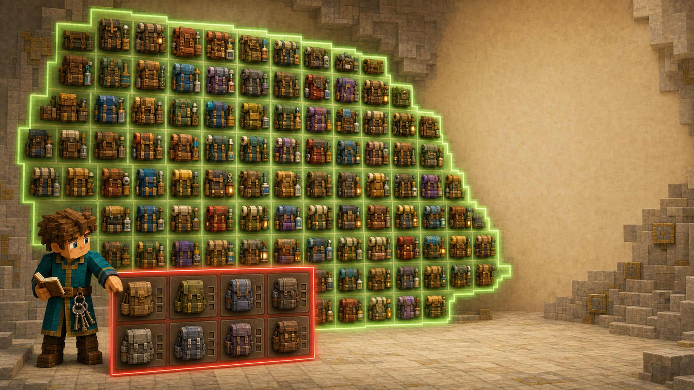
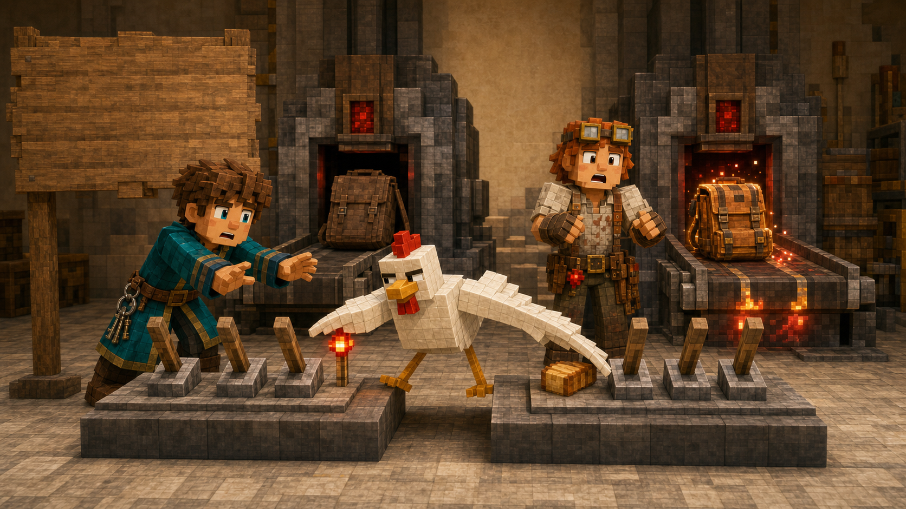

# 第十课 为什么反过来数更简单？

## 第一部分 一只很轻的背包和一份很重的事故报告

丰收节结束后的第二天，北方勘察队准备出发。

他们的目的地是深板岩矿层下方那条新发现的通道。矿工们已经确认，通道周围生长着大量幽匿方块，声音会沿着地面传播，火把熄灭后还会从黑暗里传来沉重的脚步声。

至于脚步声属于什么，矿工们仍然没有达成一致。

有人认为那是远古城市里的守卫。

有人认为只是几只体形很大的蝙蝠。

还有一名矿工坚持说，自己曾在黑暗中看见一个比铁傀儡还高的身影。财政大臣听完后，第一反应不是危险，而是询问“这种生物如果受雇守仓库，需要发几份面包”。

没有人回答。

有些问题不需要计算，因为提出它本身已经足够说明问题。

军械库里，六十四种远征背包方案已经全部整理完毕。长桌上摆着铁剑、床、水桶、火把、牛奶和面包，红石工程师制造的六拉杆配装机也被推到了大厅中央。

国王拿起安全大臣提交的新规定，宣布道：“每套允许出发的背包中，火把、牛奶和面包至少要带一种。”

托马斯点了点头。

这个条件十分合理。

火把可以照明，牛奶可以解除中毒和其他异常效果，面包则能阻止队员在一场危险远征中，最后因为忘记吃饭而倒在入口。三件补给不一定全部需要，但一件都不带，通常意味着队伍已经把“等待救援”写进了行动计划。

红石工程师拉动控制板，很快生成了一只背包。

铁剑，带。

床，带。

水桶，带。

火把，不带。

牛奶，不带。

面包，不带。

工程师提起背包，掂了掂重量。

“这套很轻。”

铁匠看了一眼。

“它缺少照明、食物和解除异常状态的东西。”

“所以行动速度会很快。”

“在黑暗中饿着肚子中毒以后，确实可能跑得很快。”

一名骑士认真问道：“往哪个方向跑？”

铁匠说道：“这正是没有火把的问题。”

国王把这套方案放进“不允许出发”区域。

托马斯翻开账本，准备统计符合新要求的方案数量。

最直接的办法，是按照携带了几种重要补给进行分类。

只带火把。

只带牛奶。

只带面包。

带火把和牛奶。

带火把和面包。

带牛奶和面包。

三种全部带上。

这七种补给选择中，铁剑、床和水桶又可以各自决定带或不带，因此每一种补给选择都能搭配：

\[
2^3=8
\]

种其他物品状态。

所以答案是：

\[
7\times8=56
\]

托马斯写完以后，重新检查了一遍。

计算没有问题。

可他总觉得自己走了一条有些绕的路。

为了统计“至少带一种”，他先分成“恰好带一种”“恰好带两种”和“恰好带三种”，再分别数里面的情况。现在只有三件重要补给，这样分类还不算麻烦。

如果将来有十种重要补给，并规定至少带一种，他就要把恰好带一件、两件、三件，一直数到十件。

如果规定至少带四件，则要从四件一直数到十件。

正面满足条件的情况很多，而且分散在不同类别里。

托马斯盯着控制板上的六只拉杆。

所有背包一共有六十四种。

其中不符合要求的背包，有什么共同特点？

它们不带火把。

不带牛奶。

也不带面包。

三只重要补给拉杆全部关闭。

至于铁剑、床和水桶，仍然可以自由选择。三件物品各有带与不带两种状态，因此不符合要求的方案共有：

\[
2^3=8
\]

种。

于是，符合要求的背包数量就是：

\[
64-8=56
\]

与刚才的正面分类结果完全相同。

但这一次，托马斯没有数七类合格方案。

他只数了一类不合格方案。

铁匠看着两个算式，问道：“第一个方法数的是我们想要的背包，第二个方法数的却是我们不要的。为什么答案会一样？”

“因为全部六十四种背包，被分成了两部分。”托马斯说道，“符合要求的，以及不符合要求的。它们不重叠，也没有其他情况。”

“所以呢？”

“只要知道全部有多少，再知道不符合要求的有多少，剩下的自然全部符合要求。”



国王问：“为什么不合格的情况更容易数？”

“因为‘至少带一种’包含许多可能。”托马斯解释道，“可以只带一种，也可以带两种，或者三种全部带上。但它的反面只有一个清楚的要求：三种全部不带。”

财政大臣恰好抱着庆典账本经过，听见“全部减去不符合要求”，立刻停下脚步。

“这个方法很好。”他说。

托马斯有些意外。“你也经常使用？”

“统计按时交税的村民很麻烦。”财政大臣说道，“我通常先数全部居民，再减去没有交税的。”

“没有交税的不是更难找吗？”

财政大臣沉默了一下。

“这就是目前仍需解决的部分。”

一只鸡从配装机后面钻出来，踩在“不允许出发”的背包上。它先啄了一下面包拉杆，又用翅膀碰开火把拉杆，机器随即把这套背包从不合格改成了合格。

红石工程师看着控制板。

“它修正了方案。”

托马斯把鸡抱到地上。“它只是随机碰到了两个拉杆。”

鸡昂起脑袋，显然不接受“随机”这个评价。对鸡而言，每一次踩上关键按钮，都是一项经过深思熟虑却拒绝公开细节的工程决策。

国王在安全规定上又加了一行。

**统计期间不得让鸡接近控制板。**



有些例外无法用数学解决，只能写进管理制度。

## 第二部分 想要的情况越多，反面可能越简单

托马斯把两种计算方法写在账本上。

正面数：

\[
\left(
\binom31+\binom32+\binom33
\right)\times2^3
=56
\]

反过来数：

\[
2^6-2^3=56
\]

第一种方法按照带了几种重要补给分类。

第二种方法则先数全部背包，再减去三种重要补给全部没有选择的背包。

后来，数学家把全部可能情况称为一个**全集**。

目标以外的那些情况，则叫作目标的**补集**。

如果所有情况不是目标，就是目标的补集，而且两者不会重叠，那么：

\[
\text{目标数量}
=
\text{全部数量}
-
\text{补集数量}
\]

这种方法叫作**补集计数**。

它本身没有创造新的方案，也没有让某些背包凭空消失。它只是换了一个更容易观察的方向。

托马斯在笔记本旁边写道：

**直接数目标太麻烦时，先看看目标的反面是否简单。**

尤其是在题目出现“至少”时，这个方法经常很有用。

“至少一个”的反面是“一个也没有”。

“至少两件”的反面是“零件或者一件”。

“至少 \(k\) 个”的反面则是只选择零个、一个，一直到 \(k-1\) 个。

假设从 \(n\) 件不同物品中任意选择，要求至少选择 \(k\) 件。正面计算可以写成：

\[
\binom nk+
\binom n{k+1}
+\cdots+
\binom nn
\]

也可以从全部 \(2^n\) 种子集中，减去选择数量不足 \(k\) 的方案：

\[
2^n-
\left(
\binom n0+
\binom n1+
\cdots+
\binom n{k-1}
\right)
\]

两种写法都正确。

选择哪一种，不取决于哪条公式看起来更高级，而取决于哪一边的类别更少、更容易数。

如果要求“至少选择一件”，反面只有零件这一类，反过来数显然很短。

如果要求“至少选择九十九件”，而一共只有一百件物品，那么正面只有选九十九件和一百件两类，直接数反而可能更简单。

数学并不强迫人永远从反面出发。

它只是提醒人：正门太拥挤时，房子可能还有后门。

当然，在Minecraft里从后门进入以前，最好先确认那里没有苦力怕。数学只负责缩短路线，不负责提供生物探测。

这时，军务大臣带来了下一项选择任务。

北方通道的正式勘察队需要五人。皇家骑士团与矿工队合计有十二名候选人，其中四名是经验丰富的老矿工，其余八名从未进入过深板岩层。

为了安全，五人队伍中至少要有两名老矿工。

“有多少种合法队伍？”国王问。

托马斯先尝试正面分类。

恰好选择两名老矿工时，需要从四名老矿工中选两人，再从八名新人中选四人之外? Wait five total, so choose 3 rookies. Need ensure formula. We'll continue.

恰好两名老矿工：

\[
\binom42\binom83
\]

恰好三名老矿工：

\[
\binom43\binom82
\]

恰好四名老矿工：

\[
\binom44\binom81
\]

把三种情况相加：

\[
\binom42\binom83
+
\binom43\binom82
+
\binom44\binom81
\]

计算得到：

\[
6\times56+4\times28+1\times8
=456
\]

这个方法十分清楚，因为“至少两名”可以分成恰好两名、三名和四名。

托马斯又尝试从反面计算。

十二人中选五人的全部队伍共有：

\[
\binom{12}{5}=792
\]

不符合要求的队伍只有两类：

一名老矿工也没有。

或者只有一名老矿工。

完全没有老矿工时，五个人都从八名新人中选择：

\[
\binom85=56
\]

只有一名老矿工时，先从四名老矿工中选一人，再从八名新人中选四人：

\[
\binom41\binom84
=
4\times70
=
280
\]

因此，合法队伍数量为：

\[
792-56-280=456
\]

又一次，两种方法得到相同结果。

国王看着算式，问道：“哪一种更好？”

托马斯没有立刻回答。

正面有三类：两名、三名、四名老矿工。

反面有两类：零名或一名老矿工。

这道题里，反面少一类，计算稍微短一些。

但如果老矿工一共有十名，要求至少两名，正面也许只需要处理几类，而反面仍然是零名和一名。反面依旧很清楚。

真正重要的不是养成“看见至少就一律用减法”的习惯。

而是先比较两边：

满足条件的情况容易分吗？

违反条件的情况容易分吗？

哪一边更简单，就数哪一边。

Notch直到托马斯完成两种计算后才走进军械库。他看了一眼四百五十六，没有询问公式。

“你这次为什么绕到反面？”他问。

“因为我想要的情况有很多类，而不想要的只有很少几类。”

“反面永远更容易吗？”

“不一定。要先比较。”

“那你真正改变了什么？”

托马斯想了一会儿。

“没有改变要数的对象，只改变了描述答案的方式。”

Notch点点头。

数学最强大的能力之一，并不是让人算得更快。

而是让人意识到，同一个答案可以从完全不同的方向得到。

正面道路布满分叉时，可以数反面。

目标对象难以描述时，可以数它留下的空缺。

有时，最接近答案的方向，看起来恰好是背对答案。

## 第三部分 程序员时间：机器不关心你从哪一边算

红石工程师把两道补集问题写进了程序。

第一道计算远征背包。

六件物品共有 \(2^6\) 种选择。不带火把、牛奶和面包时，只剩铁剑、床和水桶三件可以自由选择，因此不合格方案有 \(2^3\) 种。

第二道计算五人勘察队。全部队伍减去零名老矿工和一名老矿工的队伍。

```cpp
#include <iostream>
using namespace std;

long long C(int n, int k) {
    if (k < 0 || k > n) return 0;
    if (k > n - k) k = n - k;

    long long result = 1;

    for (int i = 1; i <= k; i++) {
        result = result * (n - i + 1) / i;
    }

    return result;
}

int main() {
    int backpack =
        (1 << 6) - (1 << 3);

    long long allTeams = C(12, 5);
    long long badTeams =
        C(8, 5) + C(4, 1) * C(8, 4);

    cout << backpack << '\n';
    cout << allTeams - badTeams << '\n';
}
```

程序输出：

```text
56
456
```

红石工程师说道：“程序没有真的列出六十四只背包，也没有生成七百九十二支队伍。”

“因为我们已经知道全部与反面的数量。”托马斯回答。

“如果减错了呢？”

“机器仍然会非常准确地输出错误答案。”

工程师点点头。“机器部分没有问题。”

“这句话现在听起来越来越像警告。”

机器不在乎人从正面计算，还是从反面计算。它也不在乎“至少两名老矿工”为什么是一条安全规定。它只会按照写进去的公式执行。

真正需要人完成的，仍然是判断：

全部情况是什么？

目标的反面是什么？

两者是否真的完整覆盖所有可能？

有没有某种情况既不在目标里，也没有被列入反面？

如果这三件事没有想清楚，减法就可能把正确方案删掉，或者让不合格方案悄悄留下。

当天傍晚，国王批准了四百五十六种合法队伍中的一支。两名老矿工负责领路，一名骑士负责战斗，一名绘图员记录地形，最后一名队员负责携带补给。

财政大臣问道：“为什么不选择五名老矿工？”

军务大臣回答：“只有四名。”

财政大臣看了一眼名单。“那确实构成了一个无法通过预算解决的限制。”

勘察队出发以后，红石工程师又抱来了一只金属箱。

箱子正面装着四个数字转轮，每个转轮都可以显示零到九。国王准备把重要地图锁在里面，因此需要计算这只密码箱一共有多少种密码。

托马斯看着四个位置和十个数字。

如果从十个数字中选择四个并排列，他已经学过：

\[
P(10,4)
\]

可红石工程师随手拨出：

```text
0000
```

锁竟然发出“咔哒”一声，打开了。

“同一个数字可以重复使用？”托马斯问。

“可以。”

工程师又拨出：

```text
1111
```

箱子再次打开。

托马斯停下了笔。

排列数 \(P(10,4)\) 的每一步都会减少一个可选数字，因为同一个对象不能重复使用。

可密码的四个位置彼此独立。第一位使用了零，不会阻止第二位继续使用零。

当顺序重要，而且同一个选择可以反复出现时，原来的排列公式便不再适用。

下一次，他要面对一个新的问题：

**如果可以重复，四个位置会长出多少种密码？**
