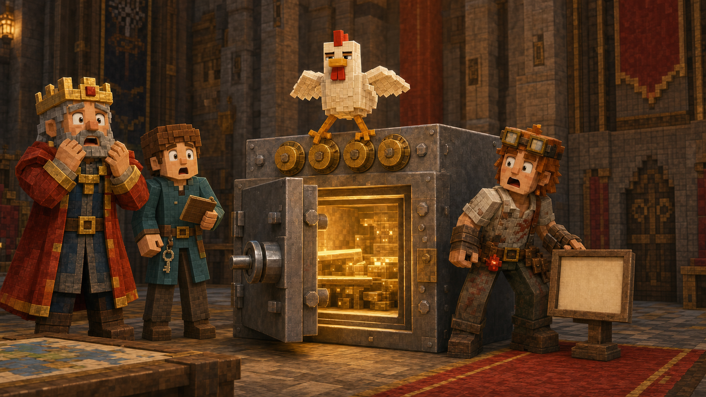
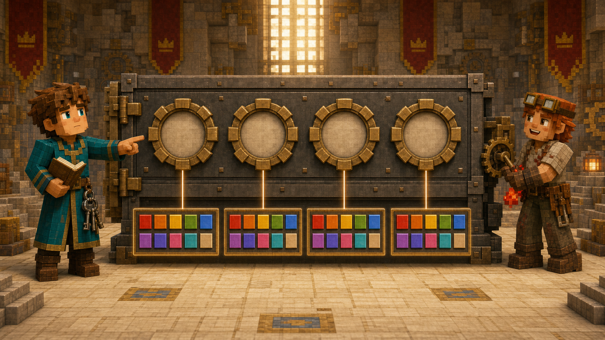

# 第十一课 为什么密码可以重复？

## 第一部分 一只谁都能打开的皇家保险箱

北方勘察队离开王城后的第二天，红石工程师把一只金属箱推进了议事厅。

箱子由铁块和深色橡木制成，四角包着金边，正面安装了四个可以转动的数字轮。每个轮子上都有从零到九的十个数字，旁边还连接着红石比较器、活塞和一盏绿色指示灯。

箱盖上方挂着一块铜牌：

**皇家最高机密保险箱。**

铜牌下面还有一行稍小的字：

**未经授权严禁打开。**

再往下，则贴着一张明显是后来补上的纸：

**也不要让鸡站在密码轮上。**

国王绕着保险箱看了一圈。“它安全吗？”

“非常安全。”红石工程师说道，“只有输入正确的四位密码，活塞才会解除锁定。”

“错误密码会怎样？”

“机器会发出警报。”

“测试过吗？”

“测试过。”

“警报响了吗？”

“没有。”

国王看向他。

工程师补充道：“因为第一次输入的就是正确密码。”

这并不能完整证明警报系统可靠，但至少证明了保险箱确实可以打开。王国的许多工程都遵循同一种验收方式：只要成功完成过一次，剩余的失败方式便留给正式使用时慢慢发现。

箱子里将存放北方矿山地图、远征队报告和几颗用于紧急交易的绿宝石。国王担心密码太容易被猜中，便让托马斯计算一共有多少种不同的四位密码。

托马斯站到保险箱前，依次转动四个数字轮。

每一位都可以从十个数字中选择：

\[
0,1,2,3,4,5,6,7,8,9
\]

“从十个数字中挑选四个排成一列。”托马斯说道，“这和仪仗队安排位置很像。第一位有十种选择，第二位剩九种，第三位剩八种，第四位剩七种。”

他写下：

\[
P(10,4)
=
10\times9\times8\times7
=
5040
\]

“五千零四十种密码。”

红石工程师没有反驳。他走到箱子前，把四个数字轮全部拨到零：

```text
0000
```

绿色指示灯亮起，箱盖发出一声清脆的“咔哒”。

锁开了。

托马斯看着四个完全相同的数字。

“同一个数字可以使用很多次？”

“可以。”工程师说道，“每个转轮都是独立的。第一个轮子使用零，并不会让后面三个轮子失去零。”

他又拨出：

```text
1111
```

保险箱再次打开。

随后是：

```text
2020
```

```text
8088
```

```text
1001
```

每一组都是合法的四位密码。

托马斯低头看向刚才的排列数。他在第二步只留下九种选择，是因为认为第一位用掉的数字不能再次使用。可保险箱里的数字不是被从桌上拿走的木牌，也不是一名只能站在一个位置的骑士。

每个密码轮都有自己完整的一套数字。

前一位选择了什么，不会减少后一位的选择。

“那么密码可以是零零零零？”国王问。

“可以。”红石工程师回答。

“这安全吗？”

“不安全，但合法。”

“这两件事有什么区别？”

“合法是机器允许。安全是人不应该真的这样设置。”

程序和锁具总能执行人类要求的规则，却不会主动阻止国王把最高机密密码设成四个零。机器没有责任保护人类免受过于自信的密码选择，这一点它们执行得十分坚定。

财政大臣走近保险箱，指着：

```text
0007
```

问道：“这算四位密码，还是数字七？”

“密码是四个位置。”托马斯说道，“最前面的零不能删掉。”

“可在普通数字里，0007和7相同。”

“因为这里数的不是整数大小，而是四个密码轮的状态。第一个轮子显示零、第二个显示零、第三个显示零、第四个显示七，这与只输入一个七不是同一种操作。”

密码看起来像一个数字，却不一定按照数字的规则工作。

保险箱要求四个位置，每个位置都必须保留。`0007`、`0070`、`0700`和`7000`虽然都只含一个七，却是四种完全不同的密码。

顺序仍然重要。

数字也允许重复。

托马斯原以为自己只要在排列与组合之间做选择，现在却发现，还少问了一个问题：

**同一个对象能不能再次使用？**

仪仗队里，一名骑士站到第一个位置以后，就不能同时站到第二个位置，因此可选人数会逐步减少。

密码里，一个数字出现在第一位以后，仍然可以继续出现在第二、第三和第四位，所以每一步始终都有十种选择。

正在这时，那只经常出现在关键设备附近的鸡从窗台跳了下来。

它先踩了一下第一个密码轮，又用爪子拨动第二个，最后站到保险箱顶上整理羽毛。四个数字轮停在：

```text
3141
```

绿色指示灯亮了。

箱子再次打开。

议事厅安静下来。

国王看着鸡。

红石工程师看着锁。

托马斯看着那张“不要让鸡站在密码轮上”的纸。

工程师最先开口：“这只是巧合。”

托马斯问：“它怎么知道正确密码？”

“它不知道。”

“那为什么打开了？”

“因为它随机碰到了正确状态。”

鸡昂起头，显然认为“随机”再次低估了它的技术能力。

国王立即下令更换密码，并在保险箱外增加一层防鸡护栏。数学可以告诉人类密码空间有多大，却无法保证一只长期参与皇家工程的鸡不会偶然猜中其中一个。



有些风险来自数量太少。

另一些风险则来自鸡实在太闲。

## 第二部分 每个位置都有完整的选择

托马斯没有继续使用排列公式，而是重新从四个位置分析。

第一位密码可以是零到九，共十种选择。

无论第一位选择了什么，第二位仍然可以是零到九，仍有十种。

第三位也是十种。

第四位还是十种。

所以，完整密码数量是：

\[
10\times10\times10\times10
=
10000
\]

也就是：

\[
10^4=10000
\]

托马斯把新答案写在五千零四十旁边。

如果不允许数字重复，答案是：

\[
10\times9\times8\times7=5040
\]

如果允许数字重复，答案是：

\[
10\times10\times10\times10=10000
\]

两个问题都有四个位置，顺序也都重要。

区别只在于，前面使用过的数字能不能继续使用。



国王问道：“为什么允许重复以后，第二位还是十种？”

“因为每个位置面对的是一套完整数字。”托马斯回答，“第一位选择七，只改变了第一位的状态，没有从第二个转轮上拿走七。”

“如果密码规定每个数字只能出现一次呢？”

“那每选择一个数字，后面就少一种，重新变成排列：

\[
P(10,4)
\]
”

“如果允许重复，但第一位不能是零呢？”

托马斯看向四个密码轮。

第一位只能从一到九中选择，共九种。

后面三位仍然可以使用零到九，各有十种。

因此：

\[
9\times10\times10\times10
=
9000
\]

种。

这说明：

\[
n^m
\]

并不是所有密码问题的固定答案。

它成立的条件是：

有 \(m\) 个彼此有区别的位置。

每一个位置都有同样的 \(n\) 种选择。

选择可以重复。

如果不同位置的可选数量不同，就应该按照分步乘法原理，把每一步实际拥有的选择数相乘。

例如，王国车牌由两位字母和三位数字组成。假设字母有二十六种，数字有十种，并且都允许重复，那么车牌数量是：

\[
26\times26\times10\times10\times10
=
26^2\times10^3
\]

不是：

\[
36^5
\]

因为字母位置不能使用数字，数字位置也不能随便塞进字母。每一步到底有多少选择，仍然要由规则决定。人类很喜欢看到五个位置后，立刻寻找一个数字的五次方，仿佛指数能够替自己阅读题目。指数对此从不负责。

托马斯把一般规律写在账本上。

如果有 \(m\) 个有顺序的位置，每个位置都有 \(n\) 种选择，而且选择可以重复，那么一共有：

\[
n^m
\]

种结果。

它常被称为**可重复排列**，也可以理解为“重复选择且顺序重要”的计数模型。

底数 \(n\) 表示每个位置有多少种选择。

指数 \(m\) 表示需要填写多少个位置。

这与远征背包的：

\[
2^n
\]

看上去很像，却不是同一个问题。

远征背包中，有 \(n\) 件不同物品，每件物品做一次“选或不选”的决定，所以是 \(n\) 个位置，每个位置两种状态：

\[
2^n
\]

密码中，有 \(m\) 个密码位，每一位都从 \(n\) 个符号中选择，因此是：

\[
n^m
\]

两个公式都来自分步乘法。

区别在于，什么被看作“一个位置”，以及每一步有多少选择。

铁匠为了检验托马斯是否真的理解，拿来几种问题。

“掷一枚六面骰子四次，记录每次点数。”

“每次有六种结果，共四次，而且同一点数可以反复出现，所以：

\[
6^4
\]
”

“从六名骑士中选四名，分别安排旗手、号手、护卫长和侦察兵，同一个人不能担任两个职位。”

“不能重复使用，所以不是 \(6^4\)，而是：

\[
P(6,4)=6\times5\times4\times3
\]
”

“用红、黄、蓝三种羊毛铺一条五格长的装饰带，每一格任选一种颜色。”

“格子位置不同，颜色可以重复，所以：

\[
3^5
\]
”

“从红、黄、蓝三种羊毛中挑选五块放进箱子，只关心各种颜色各有几块，不关心放入顺序。”

托马斯停了一下。

这一次，羊毛可以重复选择，但顺序不重要。

红、红、黄、蓝、蓝，与蓝、红、蓝、黄、红，放进箱子以后都只是两块红色、一块黄色和两块蓝色。

它不属于当前的 \(3^5\)，因为 \(3^5\) 会把五个位置的颜色顺序全部保留下来。

铁匠点点头。“看来允许重复以后，还要继续问顺序是否重要。”

排列与组合的区别并没有消失。

它只是多出了一条新的分岔：

不允许重复、顺序重要，是普通排列。

不允许重复、顺序不重要，是普通组合。

允许重复、顺序重要，是 \(n^m\)。

允许重复、顺序不重要，则需要另一种方法。

Notch来到议事厅时，托马斯已经在纸上画出这四个方向。

他没有帮托马斯补充公式，只问了一句：“你以前为什么每选一次，可用对象都会减少？”

“因为同一个骑士或物品不能再次使用。”

“今天为什么不减少？”

“因为每个位置都能重新从完整选项中选择。数字不是从公共箱子里拿走的，它们只是显示在不同转轮上。”

Notch看了一眼保险箱。

“所以真正要问的，不只是有几个位置。”

“还要问每一步的选择会不会消耗掉后面的可能。”

托马斯点头。

这句话比“看见密码就用幂”更重要。

有些选择会消耗资源。

有些选择只确定当前状态，并不影响以后。

如果没有先分清这两种情况，`10×9×8×7`和`10^4`都会算得非常正确，然后分别回答两个不同的保险箱。

## 第三部分 程序员时间：从零零零零走到九九九九

红石工程师决定让程序验证一万种密码。

他原本计划让机械手真的转动四个密码轮，从：

```text
0000
```

一直尝试到：

```text
9999
```

财政大臣问：“每尝试一次需要多久？”

“一秒。”

“全部尝试多久？”

工程师计算了一下。

“一万秒。”

“接近三个小时。”

“机器不会累。”

“守在旁边的人会。”

于是，他们暂时放弃机械演示，只让程序枚举四个位置：

```cpp
#include <iostream>
using namespace std;

int main() {
    int total = 0;

    for (int a = 0; a <= 9; a++) {
        for (int b = 0; b <= 9; b++) {
            for (int c = 0; c <= 9; c++) {
                for (int d = 0; d <= 9; d++) {
                    total++;
                }
            }
        }
    }

    cout << total << '\n';
}
```

程序输出：

```text
10000
```

四层循环分别代表四个密码位。

最外层固定第一位。

第二层尝试第二位。

第三层和第四层继续完成后面的选择。

无论前一层选过什么，下一层仍然从零走到九，因此每层始终有十种状态。

托马斯问：“如果不允许数字重复呢？”

红石工程师在最里面增加判断：只要四个数字中有两个相同，就跳过这组密码。

程序最后会得到：

```text
5040
```

与：

\[
P(10,4)
\]

完全一致。

“程序可以通过条件决定允不允许重复。”工程师说道。

“但条件是谁决定的？”

“制造锁的人。”

“机器会不会觉得四个相同数字不安全？”

“不会。只要它们与设定密码相同，机器就会开门。”

红石工程师说完，又看了一眼刚才被鸡碰开的保险箱。他默默把新密码改成了一组更复杂的数字，并在外层防护罩上加装了按钮盖。

机器能够遍历一万个密码，却不知道哪一个密码容易被猜到。

计数告诉人们搜索空间有多大，却不等于告诉人们安全性有多高。

如果国王把密码设置成`0000`，攻击者不需要尝试一万次。大概第一次就会成功，因为人类选择密码时往往比数学空间小得多。他们拥有一万个选项，却热衷使用生日、连续数字和四个相同字符，然后对锁被打开表现出真诚的意外。

Notch站在机器旁边，问道：“程序真的理解一万是怎样出现的吗？”

托马斯回答：“它只完成四层循环，把每一种状态走了一遍。我们则知道，每一层有十种选择，所以不用枚举也能直接得到 \(10^4\)。”

“哪一种更有用？”

“看问题。只想知道数量，用乘法就够了；想检查某个密码、列出全部状态或寻找符合条件的密码，机器就要实际尝试。”

Notch点了点头。

理解结构与重复执行，并不是互相替代的两种能力。

数学让人提前知道世界有多大。

程序则可以在那个世界里一格一格地走。

当天傍晚，村民食堂送来了一份新的补给计划。

远征队准备从三种食物中领取五份补给：

苹果、面包和胡萝卜。

同一种食物可以领取多份，五份补给的先后顺序不重要。三只苹果、两块面包，与先拿面包、再拿苹果，最后装进箱子以后没有区别。

食堂管理员问：

“共有多少种不同的食物搭配？”

托马斯看向五只空格，又看向三种食物。

如果把五个位置全部区分开，每格有三种选择，就会得到：

\[
3^5
\]

可是这样会把：

苹果、苹果、面包、胡萝卜、苹果，

和：

胡萝卜、苹果、苹果、苹果、面包，

当成两种方案。

实际上，它们装进箱子以后都是：

三份苹果。

一份面包。

一份胡萝卜。

允许重复，却不在乎顺序。

托马斯慢慢划掉了刚写下的 \(3^5\)。

下一次，他必须解决最后一种情况：

**同一种东西可以选很多次，但拿取顺序又完全不重要时，怎样避免把同一种搭配重复数上几十遍？**
