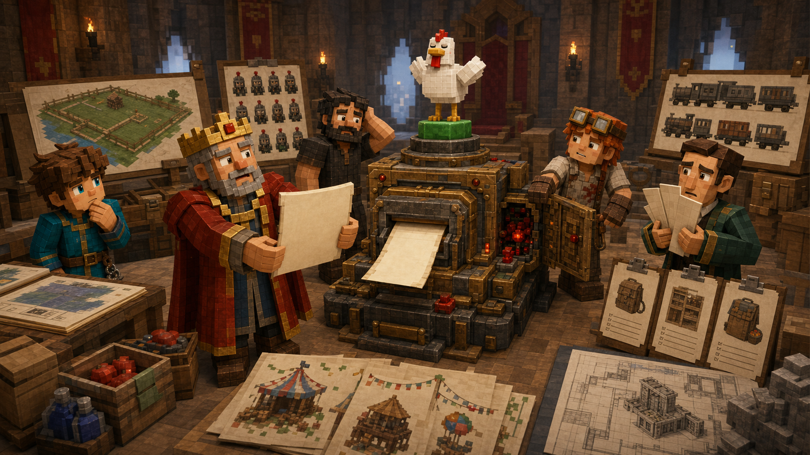
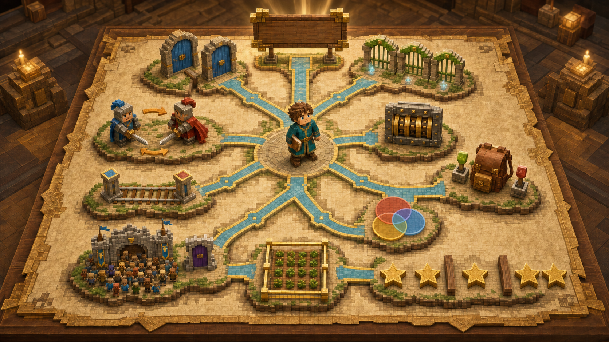

# 第十三课 数学家为什么总喜欢改变问题？

## 第一部分 国王没有带来一道新题

北方远征队出发后的第七天，王国迎来了建城以来最忙碌的一个早晨。

国王决定举办一场“皇家工程博览会”，把过去一年完成的新仓库、农田、铁路、红石机器和远征装备全部展示给邻国使者。消息公布以后，各部门立刻开始准备。建筑师规划展区，铁匠打磨武器，财政大臣计算预算，村民们则围在公告牌前发出此起彼伏的“哼”，仿佛只要声音足够多，庆典就能自行完成。

红石工程师对此充满信心。

他在议事厅中央摆了一台新机器，机器正面安装着一块巨大的绿色按钮，按钮上写着：

**皇家万能计数器。**

国王绕着机器看了一圈。“它能做什么？”

“所有计数问题。”工程师回答，“只要按下按钮，机器就会自动计算答案。”

“它怎么知道要算什么？”

“先输入几个数字。”

“输入哪些数字？”

工程师停顿了一下。“取决于要算什么。”

国王又问：“那由谁判断要算什么？”

工程师看向托马斯。

托马斯也看向工程师。

这台所谓的万能计数器，似乎已经把最困难的部分非常巧妙地交还给了使用者。人类制造“万能工具”时经常采用这种设计：它什么都能做，前提是你已经知道该让它做什么。

国王还没来得及继续询问，各部门的人便抱着任务单涌进了议事厅。

建筑师最先铺开图纸。博览会入口要悬挂六面不同的旗帜，他想知道六面旗帜排成一列共有多少种顺序。

军务大臣紧接着递来骑士名单。十二名骑士中，需要安排一名旗手、一名号手和一名护卫长。

皇家铁匠又放下一张远征名单。同样十二名骑士，还要选择五人组成护送队，但这一次不分职位。

庆典主管带来七件装饰品。每件都可以安装，也可以不安装，他需要知道全部装饰方案有多少种。

安全大臣补充说，七盏红石灯中至少要点亮三盏，否则夜间可能生成怪物。至于为什么博览会计划持续到深夜，他解释说，这是为了让邻国使者充分感受王国对照明技术的信心。

售票员拿来四位入场密码。每一位都可以使用零到九，同一个数字可以重复出现。

食堂管理员则要求从苹果、面包和胡萝卜三种食物中选出五份，同一种食物可以拿很多份，装进箱子以后不考虑拿取顺序。

铁路部门想统计所有连续行程。

建筑师还想知道展览地板里有多少个长方形。

财政大臣最后抱来三张报名表，宣布矿工、建筑师和红石技师之间存在大量人员重叠，需要统计实际参与人数。

议事厅很快被图纸、名单、旗帜、食物、车票和一只不知道从哪里来的鸡占满。

鸡站在皇家万能计数器上，低头看着那个绿色按钮。

托马斯立刻走过去，准备把它抱下来。

晚了一步。

鸡踩下按钮。

机器发出一阵响亮的齿轮声，几排红石灯依次点亮，打印机缓缓吐出一张纸：

**答案：42。**

议事厅安静了片刻。

国王拿起纸条。“这是哪一道题的答案？”

红石工程师检查机器。“目前无法确定。”

“为什么是四十二？”

“因为机器默认输入了六和七。”

“六乘七确实等于四十二。”托马斯说道，“但这里没有一道题只需要六乘七。”

工程师点点头。“机器部分没有问题。”



托马斯忽然发现，这句话在某种意义上确实成立。

机器完成了一次正确乘法。

只是没有回答任何人真正提出的问题。

眼前的任务里到处都是数字：

六面旗帜。

十二名骑士。

五人队伍。

七件装饰。

四位密码。

三种食物。

五份补给。

如果只盯着数字，很容易随手相加、相乘，或者从记忆中拖出某条公式。但同样的十二和五，既可能得到排列数，也可能得到组合数；同样的三和五，既可能得到 \(3^5\)，也可能得到重复组合。

真正决定方法的从来不是数字长什么样。

而是问题认为怎样才算一个新答案。

托马斯没有立刻计算任何任务。他先把所有任务单分开放好，又在桌子中央放下一张空白纸。

国王问：“你准备先解决哪一题？”

“先不解决。”托马斯说道。

财政大臣皱起眉头。“庆典明天开始。”

“正因为时间不多，才不能每拿到一张纸就开始算。”托马斯指向那台输出四十二的机器，“在计算以前，我们要先弄清每一题究竟在数什么。”

红石工程师看了看自己的万能计数器，默默用一块布盖住了绿色按钮。

鸡站在布上，表现得像一位刚刚完成系统测试的高级工程师。

托马斯拿起第一张任务单。

六面旗帜全部挂上，而且从左到右的位置不同。交换两面旗帜，入口的样子就会改变，因此顺序重要；每面旗帜只能使用一次，不能重复。

这是全排列：

\[
6!
\]

第二张任务同样涉及顺序，但不需要十二名骑士全部上场，只安排旗手、号手和护卫长三个职位。同一个人不能同时占据两个职位，因此是：

\[
P(12,3)
\]

第三张任务仍然从十二名骑士中选择，但只组成五人护送队，不分职位。五人交换站位以后还是同一支队伍，所以应该去掉无意义顺序：

\[
\binom{12}{5}
\]

第四张任务中的七件装饰，每件都可以独立决定安装或不安装。选择数量不固定，每件物品都有两个状态，因此全部方案是：

\[
2^7
\]

第五张要求至少点亮三盏灯。可以按照恰好三盏、四盏，一直到七盏分类：

\[
\binom73+\binom74+\binom75+\binom76+\binom77
\]

也可以用全部方案减去只点亮零盏、一盏和两盏的情况：

\[
2^7-
\left(
\binom70+\binom71+\binom72
\right)
\]

哪一种更好，不是由“至少”两个字自动决定，而要比较正面与反面哪一边更容易数。

四位入场密码有四个有区别的位置，每一位都可以重新使用零到九，所以是：

\[
10^4
\]

三种食物中选择五份，同一种可以重复，最终只关心苹果、面包和胡萝卜各有多少份，不关心领取顺序。因此需要使用隔板法：

\[
\binom{5+3-1}{5}
=
\binom75
\]

铁路的连续行程由起点和终点决定。

展览地板中的长方形由两条横向边界和两条竖向边界决定。

三张人员名单则不能直接相加，因为同一个人可能同时出现在多个名单里，需要使用容斥或唯一编号去掉重复。

托马斯说完以后，议事厅里没有立刻响起掌声。

财政大臣正在重新计算预算。

建筑师在修改旗帜架。

军务大臣则在检查旗手和护送队是否会选择到同一个人。

真正理解一个方法以后，人们通常不会鼓掌，而会立刻带来更多工作。这大概是知识被实际采用的可靠标志。

国王看着桌上的任务单，问道：“这些题目看起来完全不同。你为什么能迅速知道该用哪一种方法？”

托马斯低头看向那张空白纸。

他并不是记住了每一个故事。

他记住的是，每个故事逼着自己回答过什么问题。

仓库教会他先定义统计对象。

军械库教会他区分分类与分步。

农田教会他寻找决定对象的边界。

仪仗队和巡逻队教会他判断顺序是否重要。

背包教会他逐个判断选或不选。

密码箱让他注意选择能不能重复使用。

食堂则让他看见，允许重复以后，仍然要判断顺序是否保留。

庆典名单提醒他，类别可能发生重叠。

安全规定又告诉他，目标太复杂时，可以先数反面。

这些知识不是一堆孤立公式。

它们是一连串在计算以前必须问清楚的问题。

## 第二部分 托马斯的计数地图

托马斯在空白纸的最上方写下一句话：

**第一步不是计算。**

**第一步是定义一个答案。**

国王问：“什么叫定义一个答案？”

“要先说清楚，怎样的两个结果算相同，怎样的差别会产生新结果。”托马斯回答，“如果这件事没有确定，后面的加法、乘法和公式都可能非常正确地数错对象。”

同样五名骑士，成员相同但站位不同：

在仪仗队中可能是不同结果。

在普通巡逻队中却是同一个结果。

同样是五份食物：

如果分别放在五个有编号的位置，顺序不同就是新方案。

如果全部扔进同一只补给箱，只关心每种食物的数量，顺序便没有意义。

问题中的对象不会主动告诉人如何判断相同。

这项规则必须先由人说清楚。

托马斯在第一句话下面继续写：

**这是分类，还是分步？**

如果一个结果只需要属于几个互不重叠类别中的一个，分别统计后应该相加。

如果一个完整结果必须连续完成多个步骤，每一步的选择要接在前一步后面，通常应该相乘。

接下来，他写下第三个问题：

**顺序重要吗？**

交换两个对象以后，结果是否改变，是最直接的检验。

顺序重要，排列必须保留。

顺序不重要，就不能把同一批对象的不同写法重复统计。

第四个问题是：

**同一种选择可以重复使用吗？**

一名骑士被安排到旗手位置以后，不能同时担任号手，因此后面可选人数减少。

密码第一位使用数字七以后，第二位仍然可以使用七，因此后面选择数量不变。

是否允许重复，会让排列数与幂产生完全不同的结果。

第五个问题是：

**选择数量固定吗？**

从十二名骑士中恰好选五人，是一个组合数。

七件装饰品每件都可以装或不装，最终可能选择零件、一件或七件，因此是全部子集：

\[
2^7
\]

第六个问题是：

**对象必须连续吗？**

如果必须连续，不能再逐个决定中间对象选或不选。

一段铁路、一段字符串或一排相邻箱子，只需要确定左右边界，中间内容便自动保留。

第七个问题是：

**类别会重叠吗？**

互不重叠的类别可以直接相加。

如果同一个人可能出现在多张名单里，必须追踪他被加了几次、减了几次，再用容斥修正。

第八个问题是：

**正面难数，反面是否更容易？**

“至少一个”包含许多可能。

“一个都没有”往往只有一种状态。

但补集并不是“看见至少就立刻做减法”。只有当反面确实更简单时，绕路才值得。

最后，托马斯写下：

**能不能换一种对象来数？**

长方形难以逐个绘制，就数边界。

食物搭配难以直接排列，就数星星与隔板。

一个对象本身复杂，不代表决定它的信息也复杂。

只要新的表示与原对象一一对应，数清新对象，就等于数清原对象。

托马斯把这些问题连接起来，画成一张“皇家计数地图”。

地图最中央不是某条公式，而是一句话：

> **我到底在数什么？**

围绕它，才是不同道路。

其中最核心的选择模型，被他整理成一张总表：

| 问题类型 | 同一种选择能否重复 | 顺序是否重要 | 数量 |
|---|---:|---:|---:|
| \(n\) 个对象全部排队 | 否 | 是 | \(n!\) |
| 从 \(n\) 个中选 \(m\) 个排入不同位置 | 否 | 是 | \(P(n,m)\) |
| 从 \(n\) 个中选 \(m\) 个组成一组 | 否 | 否 | \(\binom nm\) |
| \(n\) 个对象任意选择 | 否 | 否 | \(2^n\) |
| 从 \(n\) 个中至少选择 \(k\) 个 | 否 | 否 | \(\displaystyle\sum_{i=k}^{n}\binom ni\) |
| 长度为 \(m\)，每个位置有 \(n\) 种选择 | 是 | 是 | \(n^m\) |
| 从 \(n\) 种中选 \(m\) 份，只看各类数量 | 是 | 否 | \(\displaystyle\binom{n+m-1}{m}\) |

托马斯在表格旁边特别加了一行说明：

**“能够重复”指同一种选择能否再次使用，不是答案能不能重复统计。答案永远不应该无缘无故重复统计。**

随后，他又贴上三张补充木牌。

第一张写着：

**连续的一段：数边界。**

一排 \(n\) 个对象的非空连续片段：

\[
\binom{n+1}{2}
\]

第二张写着：

**重叠的类别：检查交集。**

先加全部，再减重复；如果减得过头，还要继续加回来。

第三张写着：

**目标太散：试着数补集。**

全部减去不想要的部分，有时比把所有目标情况逐类相加更短。

建筑师看完地图，问道：“如果一道题同时有顺序、重复、限制和重叠呢？”

托马斯说道：“那就不要急着寻找一个能包办全部的公式。先把问题分层。哪些地方分类，哪些地方分步，哪些限制需要排除，分别处理。”

“所以计数地图不是一台自动选择公式的机器？”

“不是。”

红石工程师把盖在万能计数器上的布掀开一角，显得有些失望。

托马斯继续说道：“它更像一张提问顺序。地图不会替我们走路，但能防止我们一开始就朝错误方向冲出去。”



在Minecraft里，朝错误方向冲出去通常还算幸运。

更糟糕的选择是垂直向下挖。

国王把地图从头看到尾，最后问道：“这些方法中，哪一个最重要？”

财政大臣认为是补集，因为减法有助于减少支出。

建筑师认为是边界，因为没有边界的建筑通常很快会成为露天建筑。

红石工程师则认为是乘法，因为机器零件数量总能通过乘法迅速增长。

托马斯却摇了摇头。

“都不是。”

他从旧笔记本中取出第一课那块木牌。木牌边缘已经被仓库爆炸熏黑，上面仍能看清四个字：

**不重，不漏。**

“所有方法都在做同一件事。”托马斯说道，“让每个合法答案恰好出现一次。”

分类不能重叠，也不能漏掉类别。

排列必须保留有意义的顺序。

组合必须删除无意义的顺序。

边界与长方形必须一一对应。

容斥要把重复记录修正成一次。

程序枚举时，也要保证每种方案只生成一次。

公式会变化，故事会变化，数字会变化。

不重、不漏却始终没有变化。

Notch一直没有出现在议事厅里。

直到托马斯把计数地图挂上墙，他才从大门外走进来。

他站在木牌前看了很久。

“如果有一天，你忘记了所有公式呢？”Notch问。

议事厅里的其他人都安静下来。

托马斯想起自己第一次走进皇家仓库时，自信地认为只要会从一数到足够大，就能解决全部统计问题。

那一天，他的标记被搬走，账本掉进水里，苦力怕炸开箱子，一只鸡落到了他头顶。

现在，他仍然可能忘记：

\[
P(n,m)
\]

怎样写成阶乘。

也可能一时想不起隔板法究竟应该选择星星的位置，还是隔板的位置。

但他已经知道，当公式消失以后，应该从哪里重新开始。

“我会先问，我到底在数什么。”托马斯回答。

“然后呢？”

“我会判断什么算同一个答案，顺序是否重要，能不能重复，是否必须连续，类别有没有重叠。”

“如果还是数不出来？”

“我会试着分类，数反面，或者换一种对象。”

Notch又问：“如果仍然失败呢？”

托马斯看了一眼窗外。

那只鸡正试图从建筑师的长方形图纸下面钻过去，红石工程师的万能计数器再次冒出一小股烟，财政大臣则因为庆典预算比预计多出三十七块铁锭，正在与铁匠进行一场没有胜算的谈判。

“那就缩小问题，重新试一次。”他说，“失败至少会告诉我，原来的数法哪里不对。”

Notch点了点头。

“那你已经学会数了。”

## 第三部分 程序员时间：机器可以计算公式，却不能替你选择公式

红石工程师不愿意放弃皇家万能计数器。

他拆掉了那个只能输出四十二的绿色按钮，换上七个较小的按钮：

全排列。

选人排队。

选人组队。

任意选择。

至少选择。

重复密码。

重复组合。

“现在它不会乱用乘法了。”工程师说道。

托马斯看了看按钮。“由谁决定按哪一个？”

工程师沉默了一会儿。

“使用者。”

“那最困难的部分仍然没有交给机器。”

“至少它会负责计算。”

这一点没有错。

工程师把常用计数方法写进一段程序：

```cpp
#include <iostream>
#include <algorithm>
using namespace std;

long long power(long long a, int b) {
    long long result = 1;
    while (b--) result *= a;
    return result;
}

long long P(int n, int m) {
    long long result = 1;
    for (int i = 0; i < m; i++) {
        result *= n - i;
    }
    return result;
}

long long C(int n, int m) {
    if (m < 0 || m > n) return 0;
    m = min(m, n - m);

    long long result = 1;
    for (int i = 1; i <= m; i++) {
        result = result * (n - i + 1) / i;
    }
    return result;
}

int main() {
    cout << P(6, 6) << '\n';
    cout << P(12, 3) << '\n';
    cout << C(12, 5) << '\n';
    cout << power(2, 7) << '\n';
    cout << power(10, 4) << '\n';
    cout << C(5 + 3 - 1, 5) << '\n';
}
```

程序依次输出：

六面旗帜的全排列数。

十二名骑士安排三个职位的排列数。

十二名骑士选择五人组队的组合数。

七件装饰品任意选择的方案数。

四位十进制密码的数量。

三种食物选择五份的重复组合数。

每一个结果都正确。

可程序并不知道第一行为什么使用排列，第三行为什么使用组合，也不知道最后一行的“八选五”实际上来自五颗星星和两块隔板。

它只负责接受已经选好的模型，再完成乘法与除法。

红石工程师在机器上重新挂了一块牌子：

**皇家计数计算器。**

他把“万能”两个字取了下来。

国王问：“为什么改名？”

工程师回答：“它不能理解问题。”

“那谁来理解？”

工程师看向托马斯。

托马斯却摇了摇头。

“不是只有我。”

他指向墙上的计数地图。

“任何愿意先问清问题的人，都可以。”

机器能够保存公式。

书本能够记录方法。

老师可以讲解例子。

但面对一道全新的题目时，真正需要做出判断的，仍然是坐在题目前的那个人。

代码无法替他决定什么叫同一个答案。

公式无法替他判断顺序是否重要。

计算器也不会主动提醒他，自己正在认真回答另一道题。

这并不是机器的缺陷。

恰恰相反，这是思考真正属于人的地方。

博览会当天，六面旗帜按照选定顺序挂在入口，骑士站上各自岗位，五人护送队陪同使者参观，红石灯全部正常点亮。食堂准备了二十一种补给搭配，售票处使用新的四位入场密码，三类参与者也没有再被重复统计。

自动烟花装置在使者经过压力板时准时启动。

第一枚烟花飞向天空。

第二枚也飞向天空。

第三枚从侧面飞进了水池。

红石工程师看着溅起的水花。

“已经比上次好很多。”

建筑师点点头。“至少方向正确了三分之二。”

广场上的村民一起发出响亮的“哼”，大概是在欢呼，也可能是在评价烟花。村民的语言仍然没有被完整破解，这为王国保留了某种珍贵的神秘感。

国王在博览会结束后，把一枚刻有方格和数字的铜章交给托马斯。

“从今天起，你不再是皇家仓库见习管理员。”

托马斯接过铜章。“那我是什么？”

“皇家计数工程师。”

财政大臣小声问：“需要增加薪水吗？”

国王假装没有听见。

托马斯低头看着铜章。他并不觉得自己已经掌握了所有计数问题。恰恰相反，学得越多，他越清楚世界可以用多少种方式变得复杂。

Notch站在广场边缘，仍穿着那件简单的黑色短衣。

他没有参加授勋，也没有发表讲话。

等人群逐渐散去以后，他把第一课那块写着“不重，不漏”的旧木牌递还给托马斯。

木牌背面多了一句话：

> **数数不是从一开始。**

> **数数从一个好问题开始。**

托马斯把木牌收进背包。

那只鸡立刻试图钻进去。

他及时合上了背包盖。

世界没有因此变小。

仓库里依然有数不清的箱子，铁路还会继续增加车站，村民仍然会同时报名三个活动，红石机器也很可能在下次运行时发现一种前所未见的故障。

问题并没有消失。

但托马斯终于知道，面对一个陌生的“有多少种”时，不必立刻冲向数字。

他可以先停下来。

看看问题。

然后问出第一句话：

**我到底在数什么？**

**第一部完。**
